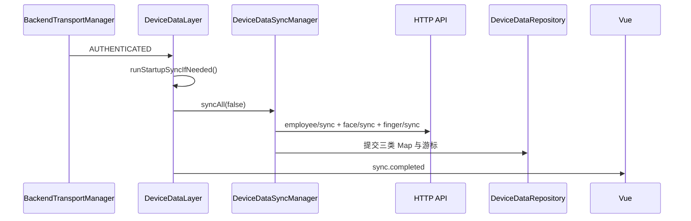
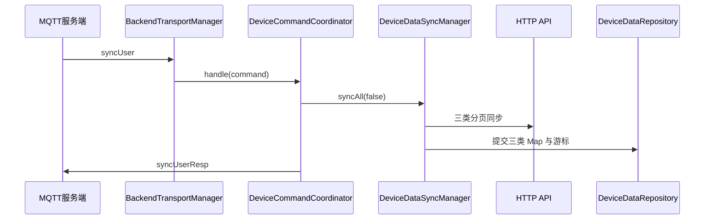
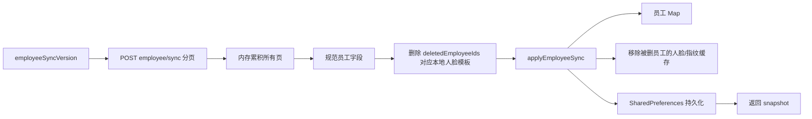

# TASK-20260725：人员同步专项基线审计

状态：仅审计与设计，禁止修改运行代码

## 1. 基线

- 仓库：`LET013/card-prod-android`
- 代码基线分支：`feature/mqtt-status-report-now`
- 基线提交：`160b83ab52745fe2107b841c82b9b97dc0620ea0`
- 设计分支：`feature/employee-sync-plan`
- 前序实现 PR：#5，Draft、未合并
- 前序永久 CI：`30175051681`，通过
- 本子项风险等级：高风险

高风险原因：需要新增公开 Bridge 动作、改变同步状态生命周期，并把现有 Android 人员同步能力暴露给非管理员 UI；同时必须避免干扰启动全同步、MQTT `syncUser`、人脸/指纹同步游标及已有 Map。

## 2. AGENTS 与所有权核对

当前基线 `AGENTS.md` 已明确：

1. 每个子项单独审计、设计、确认和实现；
2. 设计确认前只允许修改 `docs/plans/**`；
3. 前端、Facade、Android 客户端数据/业务层由本代理负责；
4. `BackendTransportManager`、`BackendHttpGateway`、`BackendHttpClient`、串口和 FaceAISDK 专业实现默认只读；
5. Vue 只能触发 Bridge，不得直接发 MQTT、HTTP 分页请求或维护业务 Map；
6. 新增 `employeeExists / synced / session` 等前置条件前必须完成生命周期审计。

`docs/CODE_OWNERSHIP.md` 允许本任务规划修改：

- `uniapp/src/**`
- `DeviceApplicationFacade.java`
- `NativeActionPolicy.java`
- `DeviceDataLayer.java`
- `DeviceStateStore.java`（仅确有必要时）
- 客户端测试

默认只读：

- `BackendTransportManager.java`
- `BackendHttpGateway.java`
- `BackendHttpClient.java`
- `SerialConnectionManager.java`
- `WorkCardProtocol.java`
- `serialport/**`
- `serial-debug/**`
- `app/libs/**`
- `FaceAiManager.java` 与人脸专业实现

本计划不要求修改任何默认只读文件。

## 3. 契约证据

当前契约源：

`docs/source-2026-07-02/Android客户端接口文档.md` V4.1。

人员同步协议：

- MQTT 双向命令名称：`syncEmployeeData`
- HTTP 替代接口：`POST /api/v1/employee/sync`
- 请求字段：
  - `lastSyncTime`
  - `page`
  - `pageSize`
- `lastSyncTime=0` 表示从零游标拉取；
- 页码从 1 开始；
- 默认每页 50，文档最大 100；
- 响应关键字段：
  - `syncVersion`
  - `employees`
  - `deletedEmployeeIds`
  - `hasMore`
  - `total/page/pageSize`

员工字段包括 `employeeId/employeeCode/employeeName/cardNo/deptId/phone/email/department/position/status/faceRegistered/fingerRegistered`。

本地公开按钮不是新的 MQTT 协议命令。正确实现仍调用现有 HTTP 人员同步接口，不增加外部字段、Topic 或服务端命令。

## 4. 当前真实入口

### 4.1 启动自动同步



特征：

- `startupDataSyncEnabled=true` 时执行；
- 每次 `DeviceDataLayer` 生命周期最多完成一次；
- 该入口同步人员、人脸和指纹全部数据；
- 本人员同步子项不得改变该行为。

### 4.2 MQTT 下行 `syncUser`



该入口同样是全类型增量同步，不得被本地“同步人员”按钮替换或改成只同步人员。

### 4.3 当前人员页面

当前 `employees.vue`：

```text
管理员进入人员页面
→ services.searchEmployees(query)
→ employee.search
→ DeviceDataRepository Map
→ Vue列表
```

页面只搜索 Android Map，不主动请求后端同步；且当前位于管理员区域。

### 4.4 当前 Vue 事件

`services.init()` 已监听：

- `sync.completed`：优先用事件快照刷新员工投影；
- `sync.employeeChanged`：重新读取员工 Map。

当前缺少：

- 公开 `sync.employees` Bridge 动作；
- 手动人员同步入口；
- `sync.statusChanged` 到 `appState.runtime.sync` 的稳定投影；
- 人员同步中的 BUSY / SUCCESS / ERROR 可见状态；
- 人员同步结果中的数量、删除数和游标展示。

## 5. 当前人员同步算法

现有 `DeviceDataSyncManager.syncEmployees(false)` 已实现：



### 5.1 分页与提交

- 每页固定 50；
- 最多 200 页，超出直接失败；
- 所有页先累积到内存；
- HTTP 分页中途失败时，尚未调用 `applyEmployeeSync`，员工 Map 和游标不会提交；
- `syncVersion > 0` 时才推进人员游标。

### 5.2 增量合并

`full=false` 时：

- 不清空员工 Map；
- 以 `employeeId` upsert；
- 只通过 `deletedEmployeeIds` 删除旧员工；
- 不根据“本次响应未出现”推断删除。

### 5.3 重启恢复

`DeviceDataRepository` 将以下内容持久化到 Android `SharedPreferences`：

- 员工 Map；
- 人脸/指纹缓存 Map；
- `employeeSyncVersion`；
- 更新时间。

APP 重启后从 Android 持久化恢复，不依赖 H5 Storage。

若员工 Map 持久化损坏：

- 清空员工 Map；
- 人员游标回到 0；
- 下次同步从零游标重新拉取。

## 6. deletedEmployeeIds 的实际影响

人员同步不是单纯刷新姓名列表。

当服务端返回 `deletedEmployeeIds` 时，现有实现会：

1. 调用 FaceAISDK 公开删除能力删除对应本地人脸模板；
2. 从员工 Map 删除员工；
3. 从本地人脸缓存 Map 删除该员工记录；
4. 从本地指纹缓存 Map 删除该员工记录；
5. 持久化新 Map 和人员游标。

这是现有一致性语义，本任务只能复用，不能在 Vue 重写或跳过。

### 已发现的既有风险

`deleteEmployeeTemplates()` 当前逐项调用 `FaceAiManager.deleteTemplate()`，没有逐项失败结果和事务回滚。

理论失败路径：

```text
全部分页已拉取
→ 已删除部分 FaceAISDK 模板
→ 后续某个模板删除抛错
→ applyEmployeeSync 尚未执行
→ 员工 Map 与游标保持旧值
→ FaceAISDK 可能已发生部分删除
```

这是现有启动同步和 `syncUser` 已存在的跨域风险，不是本次公开按钮新增的算法。由于 `FaceAiManager` 属于人脸负责人只读范围，本子项不修改其实现，也不擅自设计事务或重试协议。

本次设计必须：

- 明确显示失败；
- 不把失败描述为人员同步成功；
- 不新增第二套模板删除逻辑；
- 将该风险登记到 `OWNERSHIP_BLOCKERS.md`。

## 7. 同步并发审计

当前 `DeviceDataSyncManager` 四个同步方法是 `synchronized`：

- 不会并行修改 Map；
- 多个调用会串行排队；
- 但不能阻止重复请求排队。

当前状态入口：

- 启动同步会先写 `sync.state=SYNCING`；
- MQTT `syncUser` 会先写 `sync.state=SYNCING`；
- 同步成功或失败后更新 Store。

本地人员同步设计必须：

1. UI 请求期间禁用人员同步按钮；
2. Android 发起前读取当前 `sync.state`；
3. 已为 `SYNCING` 时立即返回 `BUSY`，不得排队执行第二次人员同步；
4. 不增加任意秒数冷却、后台轮询或第二个同步队列；
5. 继续依赖现有 `synchronized` 作为最终 Map 串行保护。

本子项不重构启动同步和 `syncUser` 的统一调度器，避免跨越人员、人脸和指纹三个未确认子项。

## 8. 前置条件生命周期

### 8.1 不要求管理员会话

人员同步是服务端到设备的只读拉取，不修改后端员工资料。用户已允许公开入口，因此计划动作 `sync.employees` 为内置可信 WebView 公共动作。

### 8.2 不要求 MQTT 已认证

人员数据实际通过 HTTP 接口同步。MQTT 断线不应阻止 HTTP 人员同步。

不得新增：

```java
if (!backendPort.isAuthenticated()) reject;
```

### 8.3 不要求已有员工

首次安装员工 Map 为空是正常状态。人员同步正是恢复员工 Map 的入口。

不得新增：

```java
if (employees.isEmpty()) reject;
```

### 8.4 数据层必须已启动

Facade 继续通过现有 `runtime()` 检查 `DeviceRuntimeRegistry`。数据层未启动时返回现有 `DATA_LAYER_NOT_READY`，用户可等待启动完成后重试。

### 8.5 HTTP未配置或设备未注册

不自行制造新的状态判断。调用现有 Gateway，由现有契约校验返回准确错误；UI显示失败并允许重试。

## 9. 当前测试覆盖

当前仓库：

- 没有 `DeviceDataSyncManagerTest`；
- 没有人员分页同步的直接 JVM 单元测试；
- 只有 JUnit 与 `org.json`，没有 MockWebServer、Mockito 或 Robolectric；
- 现有永久 CI 能验证三层、契约、前端语法、H5、Android单测和 APK；
- 前序提交已通过永久 CI。

本子项实现不能仅凭“编译通过”声称真实同步成功。必须把真实后端分页、删除ID、重启游标和目标设备效果分别标记。

## 10. 必须保持不变

1. 启动认证后继续执行现有 `syncAll(false)`；
2. MQTT `syncUser` 继续同步人员、人脸和指纹全部数据；
3. 人员同步继续使用 `POST /api/v1/employee/sync`；
4. 员工 Map 和游标继续由 Android Repository 持有；
5. Vue 不直接发送 HTTP/MQTT，不保存游标；
6. 增量同步不清空员工 Map；
7. 删除只认 `deletedEmployeeIds`；
8. 失败不清空现有员工 Map；
9. 不修改后端、HTTP底层、MQTT底层、串口或人脸专业代码；
10. 不自动加入人脸同步或指纹同步按钮。

## 11. 审计结论

本子项不需要重写人员同步协议或 Map 合并算法。

最小正确方案是：

1. 复用现有首页公开状态面板；
2. 增加一个“同步人员”入口；
3. 新增公共客户端动作 `sync.employees`；
4. `DeviceDataLayer` 调用现有 `syncManager.syncEmployees(false)`；
5. 先写 Android Store 的 `SYNCING`，完成后写 `SUCCESS/ERROR`；
6. 复用 `sync.completed` 快照刷新 Vue 员工投影；
7. 当前已有其他同步处于 `SYNCING` 时返回 `BUSY`；
8. 不修改人员同步算法、HTTP底层和专业负责人代码。
