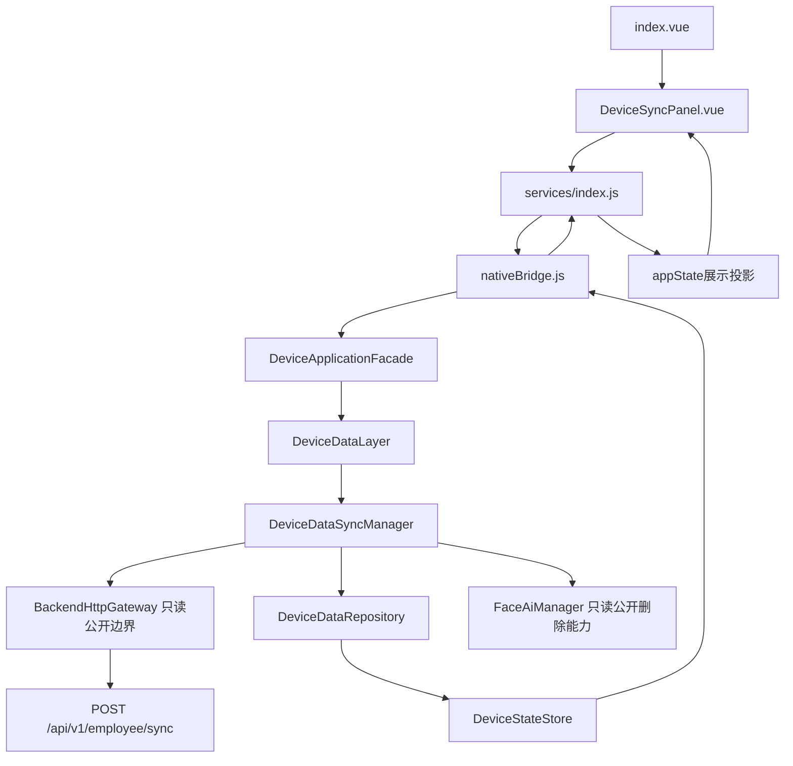
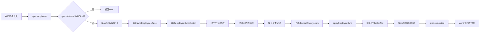
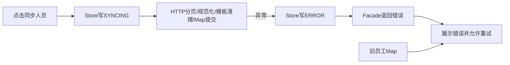
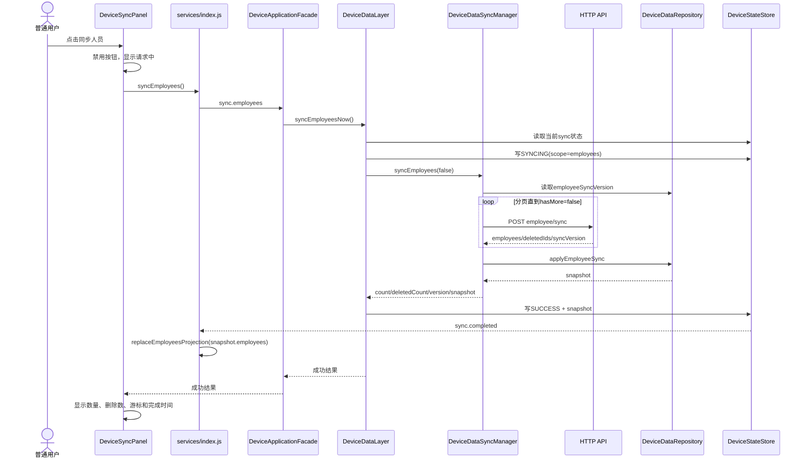
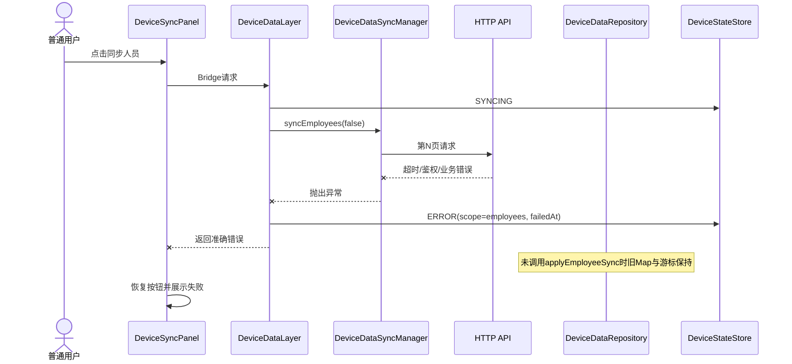
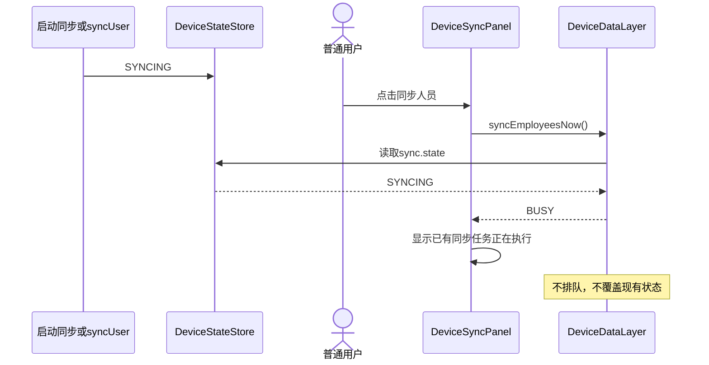
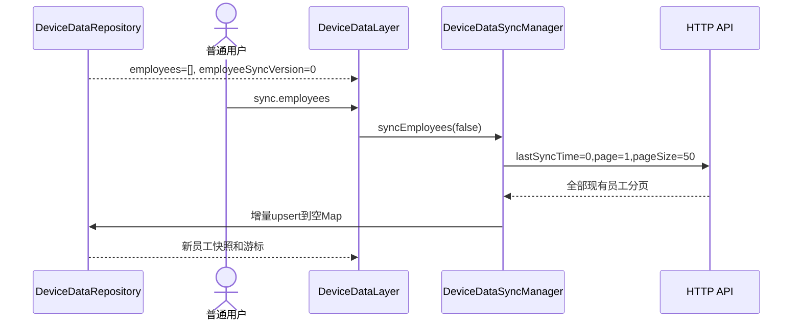
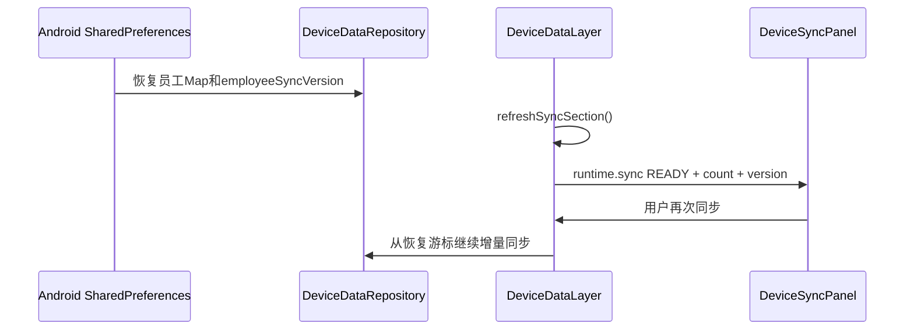
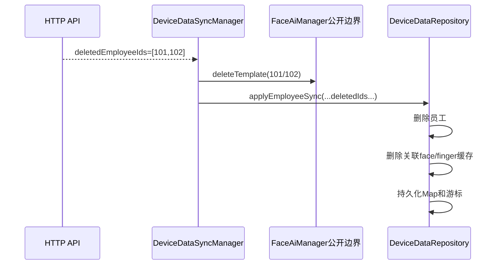
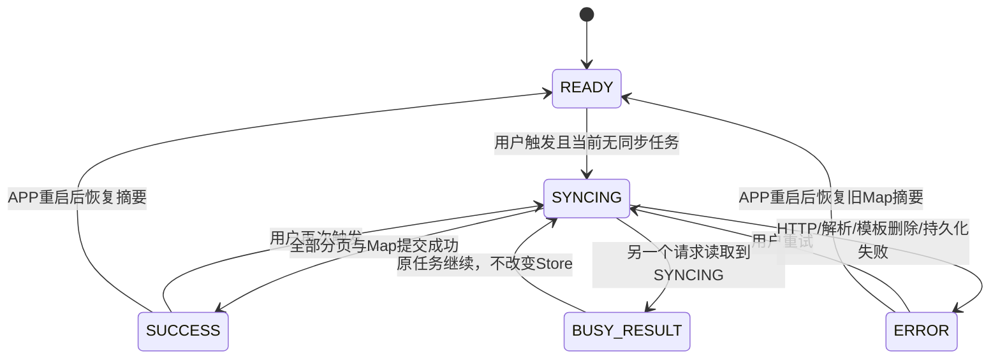

# TASK-20260725：人员同步设计方案

状态：等待用户确认，禁止修改运行代码

## 1. 设计摘要

本批不新写同步协议，也不把同步搬到 Vue。

设计目标：

```text
首页公开同步入口
→ DeviceSyncPanel
→ services.syncEmployees()
→ nativeBridge
→ DeviceApplicationFacade
→ DeviceDataLayer.syncEmployeesNow()
→ 现有 DeviceDataSyncManager.syncEmployees(false)
→ 现有 HTTP 人员分页接口
→ Android 员工 Map / 游标
→ DeviceStateStore
→ Vue 展示投影
```

## 2. 组件依赖图



只读边界：

- `BackendHttpGateway/BackendHttpClient`；
- `BackendTransportManager`；
- `FaceAiManager`；
- 串口和 AAR。

## 3. 数据流向图

### 3.1 正常人员同步



唯一真相：`DeviceDataRepository`。

Vue只保存当前 WebView 生命周期内的员工展示副本和面板状态。

### 3.2 失败数据流



失败不调用 Vue 清空，不自行把空数组当成功响应。

## 4. 时序图

### 4.1 正常增量同步



### 4.2 HTTP失败



### 4.3 已有同步任务



### 4.4 首次启动空Map



空 Map 不构成拒绝条件。

### 4.5 APP重启



### 4.6 deletedEmployeeIds



该语义保持现状，不在 Vue 重复执行。

## 5. 状态生命周期

### 5.1 人员同步状态



`BUSY_RESULT` 是本次调用返回结果，不写入 Store 覆盖正在运行的 `SYNCING`。

### 5.2 字段定义

| 字段 | 写入者 | 生命周期 |
|---|---|---|
| `state` | DeviceDataLayer | READY/SYNCING/SUCCESS/ERROR |
| `scope` | DeviceDataLayer | 本批固定 `employees` |
| `source` | DeviceDataLayer | 本批固定 `UI` |
| `message` | DeviceDataLayer | 用户可显示文本 |
| `startedAt` | DeviceDataLayer | 开始同步时写入 |
| `completedAt` | DeviceDataLayer | 成功时写入 |
| `failedAt` | DeviceDataLayer | 失败时写入 |
| `employeeCount` | SyncManager结果 | 本次返回人数 |
| `deletedEmployeeCount` | SyncManager结果 | 本次删除数 |
| `employeeSyncVersion` | Repository/SyncManager结果 | 成功提交游标 |
| `employeeTotalCount` | Repository snapshot | 当前Map总数 |
| `lastError` | DeviceDataLayer | 失败原因 |

这些字段只存在于 Android 客户端状态，不进入 HTTP/MQTT 报文。

## 6. 前置条件专项审计

### 6.1 `sync.state == SYNCING`

- 写入者：现有启动同步、MQTT `syncUser`、未来本地同步；
- 首次启动：`READY` 或启动同步写为 `SYNCING`；
- 后端离线：若没有任务则不是 `SYNCING`，调用后由HTTP返回错误；
- 数据未同步：允许调用；
- APP重启：进行中线程消失，`refreshSyncSection()`恢复为READY摘要；
- 恢复路径：等待现有任务完成后重试；
- 阻断行为：只阻止重复本地同步，不阻止现有任务。

### 6.2 管理员会话

不作为前置条件。用户已确认公开入口。

### 6.3 MQTT认证

不作为前置条件。人员同步走HTTP。

### 6.4 员工存在

不作为前置条件。空Map是合法首次同步状态。

### 6.5 HTTP配置与deviceToken

不新增推断检查。现有Gateway负责契约校验和错误输出。

## 7. UI设计

### 7.1 组件拆分

计划新建：

```text
uniapp/src/components/DeviceSyncPanel.vue
```

目的：

- 将当前 `index.vue` 中状态上报弹窗、状态和动作移出；
- 本批在同一组件中增加人员同步；
- 首页只负责打开/关闭面板；
- 未来人脸、指纹子项仍需专项审计后才允许扩展。

### 7.2 面板结构

```text
设备状态与数据同步
├── 后端/HTTP摘要
├── 卡槽状态上报
│   ├── 当前结果
│   └── 立即上报卡槽状态
└── 人员数据
    ├── 当前员工总数
    ├── 人员同步游标
    ├── 上次结果/时间
    └── 同步人员
```

不展示员工姓名、电话、邮箱等个人信息。

### 7.3 人员同步按钮

状态：

- 默认：“同步人员”；
- 请求中：“正在同步人员…”并禁用；
- BUSY：恢复按钮，显示“已有同步任务正在执行”；
- 成功：显示数量、删除数、游标；
- 失败：显示错误并允许重试。

## 8. Android设计

### 8.1 NativeActionPolicy

新增公共动作：

```text
sync.employees
```

不添加管理员权限映射。

### 8.2 DeviceApplicationFacade

新增异步入口：

```java
case "sync.employees":
    return deferred(requestId, "EMPLOYEE_SYNC_FAILED",
        () -> runtime().syncEmployeesNow());
```

复用现有单线程 `ioExecutor`，不创建新线程池。

### 8.3 DeviceDataLayer

新增：

```java
JSONObject syncEmployeesNow() throws Exception
```

职责：

1. 读取当前 `sync` section；
2. 若为 `SYNCING` 返回 BUSY，不覆盖 Store；
3. 写入 `SYNCING(scope=employees,source=UI,startedAt)`；
4. 调用 `syncManager.syncEmployees(false)`；
5. 成功时写 `sync.completed`；
6. 失败时写 `sync.statusChanged(ERROR)` 后继续抛出；
7. 不直接处理分页、删除ID或Map合并。

### 8.4 DeviceDataSyncManager

本批不修改。

继续使用当前：

```java
syncEmployees(false)
```

### 8.5 DeviceDataRepository

本批不修改。

继续使用当前：

```java
applyEmployeeSync(...)
```

## 9. Vue服务设计

`services/index.js` 新增：

```js
syncEmployees() {
  return nativeOrMock('sync.employees', {}, fallback, 120000)
}
```

超时仅是 Bridge 等待上限，不改变HTTP契约超时。

事件处理：

- `sync.statusChanged` 更新 `appState.runtime.sync`；
- `sync.completed` 更新 `appState.runtime.sync`，并继续用 `snapshot.employees` 替换员工投影。

开发 Mock 只返回明确模拟状态，不在 Release 兜底。

## 10. 文件修改矩阵

| 文件 | 操作 | 原因 | 层级 | 风险 |
|---|---|---|---|---|
| `uniapp/src/components/DeviceSyncPanel.vue` | 新建 | 抽取现有状态面板并加入人员同步 | UI | 中 |
| `uniapp/src/pages/index/index.vue` | 修改 | 只保留面板开关和组件引用 | UI | 中 |
| `uniapp/src/services/index.js` | 修改 | 新增Bridge调用和sync事件投影 | UI服务 | 中 |
| `uniapp/src/mock/data.js` | 修改 | 增加稳定的runtime.sync默认投影 | UI Mock | 低 |
| `NativeActionPolicy.java` | 修改 | 注册公共动作 | 客户端权限 | 中 |
| `DeviceApplicationFacade.java` | 修改 | 暴露异步人员同步入口 | Facade | 中 |
| `DeviceDataLayer.java` | 修改 | 状态编排、BUSY和调用现有SyncManager | 数据业务层 | 高 |
| `NativeActionPolicyTest.java` | 修改 | 验证公共动作不要求会话 | 测试 | 低 |
| `docs/plans/TASK-20260725-employee-sync/**` | 修改 | 追踪实现和验证 | 文档 | 低 |

设计外运行文件禁止修改。

明确不修改：

- `DeviceDataSyncManager.java`；
- `DeviceDataRepository.java`；
- `DeviceStateStore.java`；
- `employees.vue`；
- 后端、HTTP/MQTT底层；
- 串口；
- FaceAISDK专业文件。

## 11. 方案比较

### 方案A：在现有 `index.vue` 继续追加人员同步逻辑

优点：

- 文件数量少；
- 初次改动看似较小。

缺点：

- 首页继续混合卡槽、识别、状态上报和数据同步；
- 后续人脸/指纹子项会进一步膨胀；
- 状态变量和样式难以维护；
- 更容易出现跨功能回归。

结论：不推荐。

### 方案B：抽取 `DeviceSyncPanel.vue`

优点：

- 首页职责恢复为页面编排；
- 状态上报与数据同步集中；
- 本批只增加人员能力，不预建其他功能；
- 后续每个子项可在独立审计后扩展同一组件。

缺点：

- 会移动现有状态上报UI代码；
- 需要回归验证前序状态上报功能。

结论：推荐。

### 方案C：把人员同步按钮放到管理员人员页面

优点：

- 与人员列表位置接近。

缺点：

- 与用户要求的公开入口冲突；
- 需要管理员会话；
- 无法作为启动或故障恢复的公开操作。

结论：不采用。

### 方案D：Vue直接请求HTTP人员接口

优点：无。

缺点：

- 违反三层和唯一真相；
- 会产生第二套游标、删除和Map合并；
- 无法安全处理重启和模板清理。

结论：绝对禁止。

## 12. 验证计划

### 静态与结构

- `sync.employees` 仅为内部Bridge动作；
- Vue不存在后端同步URL、分页或游标算法；
- Facade只调用DeviceDataLayer；
- DeviceDataLayer只调用现有SyncManager；
- 保护文件diff为空。

### 单元测试

- `NativeActionPolicyTest`验证 `sync.employees` 公共且无权限；
- 现有测试全量执行；
- 不为测试引入新的Mock框架或修改专业依赖。

### 前端

- JavaScript语法；
- H5构建；
- 面板打开/关闭；
- 人员按钮请求中禁用；
- 成功/BUSY/失败文案；
- 状态上报原功能回归。

### Android构建

- JVM单测；
- Debug APK；
- 永久三层和契约门禁；
- APK资源检查。

### 真实联调

没有设备和后端证据时标记未验证：

- 真实分页；
- `deletedEmployeeIds`；
- 游标重启恢复；
- 真机UI；
- FaceAISDK模板删除失败路径。

## 13. 实施门禁

必须先确认：

1. 复用当前公开Header入口；
2. 抽取 `DeviceSyncPanel.vue`；
3. 公开入口只执行增量人员同步；
4. 已有同步时返回 BUSY，不排队；
5. 保留 `deletedEmployeeIds` 当前清理语义；
6. 本批不实现人脸、指纹或同步全部。

用户明确确认后才能创建实现分支。
