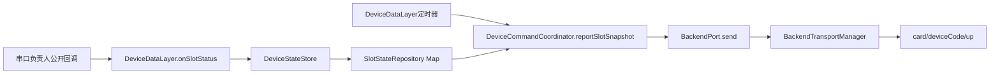
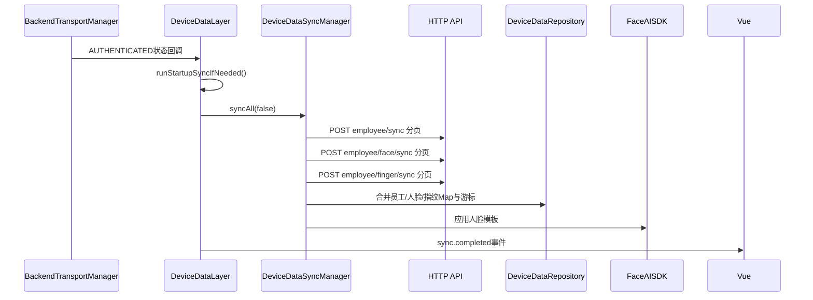
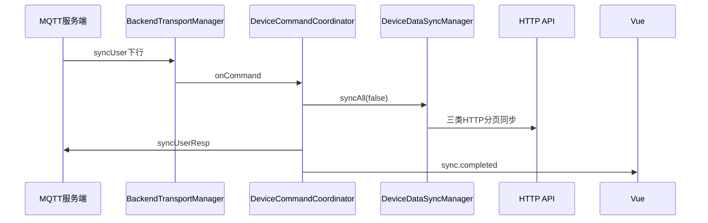

# TASK-20260725：MQTT状态上报与三类同步——基线审计

状态：仅设计阶段，禁止修改运行代码

## 1. 基线

- 仓库：`LET013/card-prod-android`
- 审计分支基线：`fix/motone-three-layer-integration`
- 基线提交：`1d90df49a2e785f8c634c58b84504298b528fea1`
- 设计分支：`feature/mqtt-sync-ui-plan`
- 风险等级：高风险

高风险原因：同时涉及公开UI入口、Bridge动作权限、Android数据层同步状态、MQTT状态上报和后端同步接口，但本阶段不允许修改运行代码。

## 2. 代码所有权

### 本任务允许规划的客户端范围

- `uniapp/src/**`
- `JsBridge → DeviceApplicationFacade`公开动作
- `DeviceDataLayer`客户端业务编排
- `DeviceStateStore`中的客户端状态投影
- 客户端单元测试与UI测试

### 默认只读范围

- 后端服务端代码与接口契约源
- `BackendTransportManager`底层MQTT连接、Topic、Envelope、签名和响应解析
- `BackendHttpGateway`/`BackendHttpClient`底层通信
- `serialport/**`
- `serial-debug/**`
- `app/libs/serialport-release-1.0.aar`
- 串口地址映射、轮询、帧解析和单板实现

本任务规划不要求修改上述只读范围。

## 3. 当前真实调用链

### 3.1 MQTT实时状态上报



当前行为：

1. `DeviceDataLayer.startSlotReporter()`按`slotStatusReportIntervalMs`启动定时任务；当前本地默认值为10000毫秒。
2. `DeviceCommandCoordinator.reportSlotSnapshot()`仅在后端业务会话已认证时执行。
3. 仅上报`updatedAt > 0`的已知卡槽，避免把默认UNKNOWN伪装成真实状态。
4. 上报命令为`statusReport`，data为`{ slots: [...] }`。
5. `BackendTransportManager`统一补充`msgId/cmd/timestamp/deviceCode/sign/data`并发布到上行Topic。
6. 当前没有Vue手动立即上报入口。
7. 当前响应消息被压缩为`source/cmd/msgId/timestamp`摘要；UI无法从现有公开状态判断`statusReportResp.code`是否为0。

### 3.2 启动自动同步



当前行为：

- MQTT或HTTP业务登录进入`AUTHENTICATED`后，默认主动执行一次增量`syncAll(false)`。
- 员工、人脸、指纹三类数据实际通过文档明确的HTTP分页接口传输。
- `DeviceDataRepository`持久化三类Map和同步游标。
- 人脸Fetched游标与Applied游标分离；模板全部应用成功后才推进Applied游标。
- 指纹同步目前只写Android缓存，员工级外接指纹硬件尚未接入。

### 3.3 MQTT下行`syncUser`



当前只处理V4.1明确的`syncUser`下行，并一次同步员工、人脸、指纹全部数据。

## 4. 当前已有能力

### 4.1 Android数据层

`DeviceDataSyncManager`已经存在：

- `syncAll(boolean full)`
- `syncEmployees(boolean full)`
- `syncFaces(boolean full)`
- `syncFingers(boolean full)`

因此三类同步算法和分页协议不是本次需要新写的功能。

### 4.2 Vue服务层

当前`services/index.js`已经能：

- 监听`sync.completed`并刷新员工投影；
- 搜索员工Map；
- 调用员工、人脸和指纹上传类接口。

但当前没有：

- 手动同步全部数据；
- 只同步员工；
- 只同步人脸；
- 只同步指纹；
- 立即请求一次状态上报；
- 在公开页面展示同步进度、同步版本和最后结果。

### 4.3 Bridge与权限

当前`NativeActionPolicy`没有同步或立即状态上报动作。

当前`DeviceApplicationFacade`没有把`DeviceDataSyncManager`的三类同步能力暴露给Vue。

## 5. 关键结论

### 5.1 不能在Vue直接实现协议

用户点击入口可以在Vue完成，但以下能力不能放入Vue：

- MQTT连接、Topic、签名和Envelope；
- HTTP分页请求；
- 同步游标；
- 员工/人脸/指纹Map合并；
- FaceAISDK模板导入；
- 状态上报数据组装和发送。

正确边界是：

```text
Vue公开按钮
→ services/index.js
→ nativeBridge
→ DeviceApplicationFacade
→ DeviceDataLayer
→ 已有同步/上报能力
```

Vue只触发并展示结果。

### 5.2 实时状态协议已接入，但闭环不完整

已完成：

- `statusReport`命令；
- V4.1 slots字段映射；
- MQTT签名Envelope；
- 周期上报；
- 仅发送真实已知卡槽。

未完成：

- Vue立即上报入口；
- UI状态展示；
- 服务端响应code/msg的客户端公开回调；
- 串口负责人尚未提供逻辑卡槽映射时，Map可能没有可上报的真实卡槽。

### 5.3 三类同步已实现，缺的是公开触发和状态展示

现有启动同步和`syncUser`下行不应重写。计划只增加客户端公开触发入口，并复用现有`DeviceDataSyncManager`。

## 6. 发现的现有风险

1. `App.vue`没有监听`sync.statusChanged`，`defaultRuntime`也没有`sync`默认节，UI无法稳定展示同步状态。
2. 手动入口若直接重复点击，虽然`DeviceDataSyncManager`的同步方法是`synchronized`，仍可能在调用队列中堆积重复任务。
3. `statusReport`当前无已知卡槽时静默不发送，UI会无法区分“已请求但无数据”和“已发送”。
4. `statusReportResp`内容没有通过现有公开回调进入客户端状态，不能把“调用完成”显示成“服务端确认成功”。
5. 当前GitHub分支中的`AGENTS.md`仍是较早版本；本任务以用户最新提供的阶段门禁和前端/客户端所有权规则执行。

## 7. 必须保持不变

- 启动自动同步继续保留。
- MQTT下行`syncUser`继续保留并同步全部三类数据。
- 三类数据继续由Android Map/Repository持有唯一真相。
- Vue不直接发MQTT或HTTP，不保存同步游标和业务数据。
- 不修改后端服务端、MQTT底层传输和串口负责人代码。
- 不把本地请求成功描述成服务端ACK成功。
- 不因为手动同步新增第二套分页、游标或模板导入逻辑。

## 8. 当前阻塞项

- 真实卡槽状态取决于串口负责人提供的逻辑卡槽回调；没有已知卡槽时立即上报只能明确返回“无可上报状态”。
- 若产品要求UI展示服务端`statusReportResp.code/msg`，需要底层传输负责人提供响应关联回调；本任务第一阶段不修改该底层实现。

## 9. 审计结论

本次不需要重写MQTT或三类同步协议。最小正确方案是：

1. 在公开首页增加同步入口和状态面板；
2. 在Vue服务层增加五个Bridge调用；
3. 在Android客户端公开五个动作；
4. 复用现有三类同步和`statusReport`上报；
5. 只显示Android本地可证明的阶段和结果；
6. 不修改后端、MQTT底层传输和串口代码。
