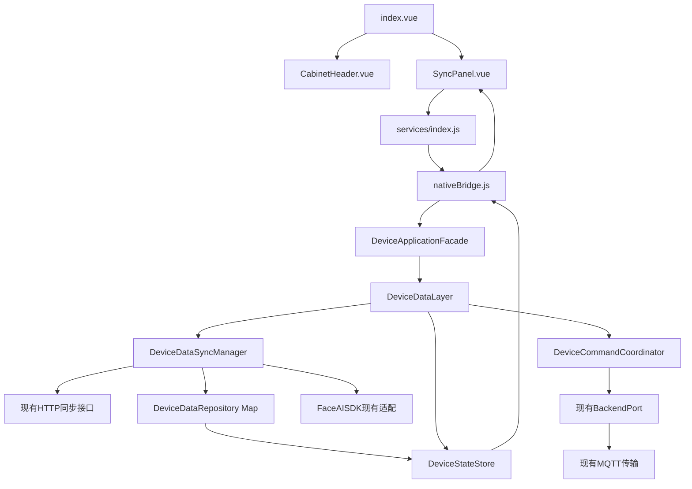
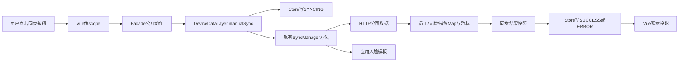
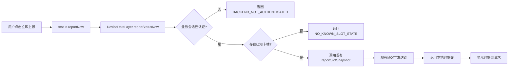
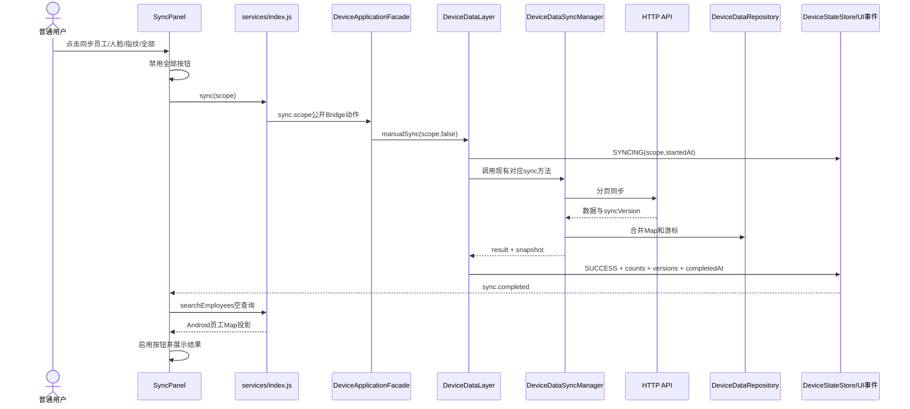
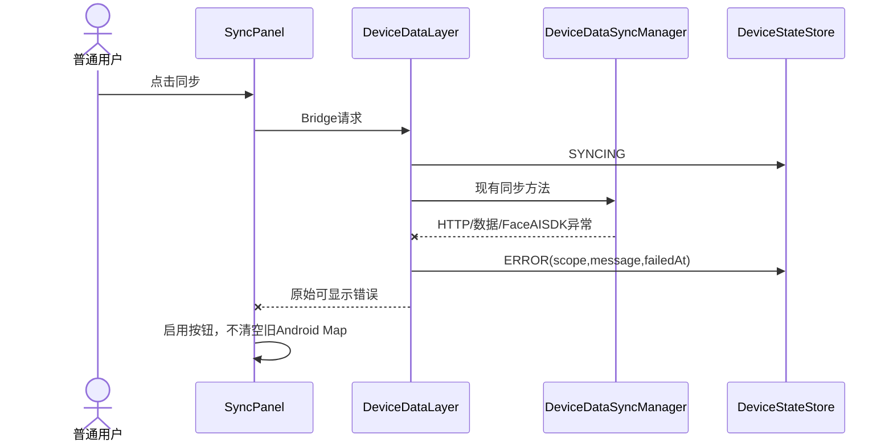
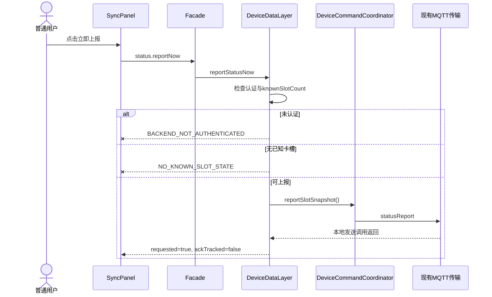
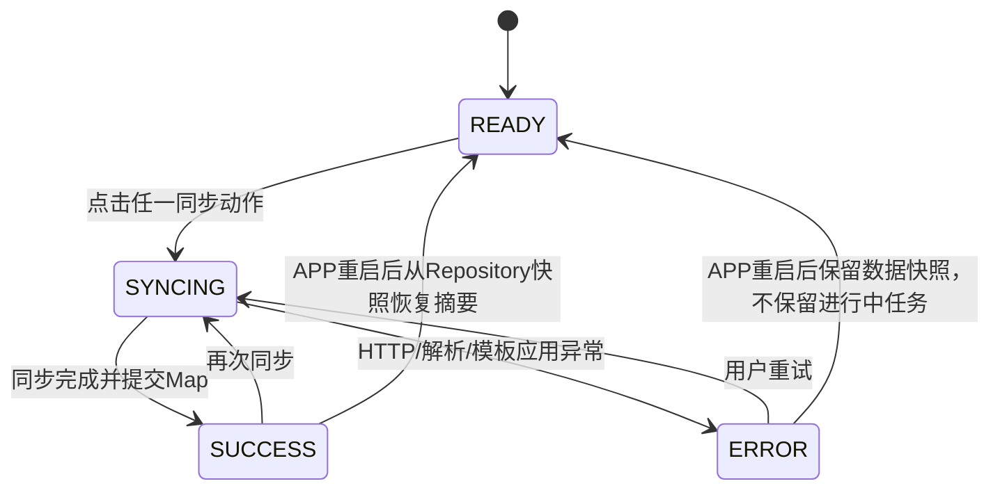

# TASK-20260725：设计方案

状态：等待用户确认，禁止修改运行代码

## 1. 设计摘要

本任务不重写MQTT和三类同步协议，只增加公开UI入口和Android客户端动作，复用现有实现。

```text
首页公开同步图标
→ SyncPanel
→ services/index.js
→ nativeBridge
→ DeviceApplicationFacade
→ DeviceDataLayer
→ 现有DeviceDataSyncManager / DeviceCommandCoordinator
```

## 2. 组件依赖图



只读边界：`BackendTransportManager`、HTTP底层、后端服务端、串口模块。

## 3. 数据流向图

### 3.1 手动同步



唯一真相：Android `DeviceDataRepository`与`DeviceStateStore`。

Vue只保存显示中的`runtime.sync`和按钮状态。

### 3.2 立即状态上报



第一阶段不把本地已提交等同于服务端ACK。

## 4. 时序图

### 4.1 公开手动同步



### 4.2 手动同步失败



失败不清空旧缓存，不推进未完成游标。

### 4.3 立即状态上报



## 5. 状态模型

新增的是客户端UI投影状态，不新增外部协议字段。



### 状态字段

| 字段 | 写入者 | 说明 |
|---|---|---|
| `state` | DeviceDataLayer | READY/SYNCING/SUCCESS/ERROR |
| `scope` | DeviceDataLayer | all/employees/faces/fingers |
| `message` | DeviceDataLayer | 用户可见说明 |
| `startedAt` | DeviceDataLayer | 本次开始时间 |
| `completedAt` | DeviceDataLayer | 成功时间 |
| `failedAt` | DeviceDataLayer | 失败时间 |
| `employeeCount` | SyncManager结果 | 本次/快照数量 |
| `faceCount` | SyncManager结果 | 本次/快照数量 |
| `fingerCount` | SyncManager结果 | 本次/快照数量 |
| `employeeSyncVersion` | Repository | 员工游标 |
| `faceFetchedVersion` | Repository | 人脸拉取游标 |
| `faceAppliedVersion` | Repository | 人脸应用游标 |
| `fingerSyncVersion` | Repository | 指纹游标 |
| `lastError` | DeviceDataLayer | 失败原因 |

### 新增前置条件审计

#### `status.reportNow`

- 条件：`backendPort.isAuthenticated()`。
- 写入者：现有BackendTransportManager状态回调。
- 首次启动：未认证，返回明确错误。
- 后端离线：返回明确错误。
- APP重启：重新登录后恢复。
- 恢复方式：等待后端连接恢复后重试。

#### 已知卡槽条件

- 条件：至少一个卡槽`updatedAt > 0`。
- 写入者：串口负责人回调进入Android Map。
- 首次启动：通常为0，不上报伪数据。
- 串口未映射：保持0并提示无可上报状态。
- 恢复方式：串口负责人提供真实卡槽更新后重试。

手动同步不新增“必须先管理员登录”“必须先MQTT认证”之类前置条件；HTTP同步请求的真实错误由现有Gateway返回。

## 6. UI设计

### 6.1 首页Header

在管理员图标左侧新增公开同步按钮：

- 图标：循环箭头/同步；
- 状态点：READY灰、SYNCING蓝色旋转、SUCCESS绿色、ERROR红色；
- 点击打开同步面板；
- 不进入管理员模式。

### 6.2 SyncPanel

建议新建`uniapp/src/components/SyncPanel.vue`，使用现有`ModalShell`。

显示：

- MQTT/后端当前状态；
- 最后同步状态和时间；
- 员工、人脸、指纹数量；
- 三类同步版本；
- 人脸模板应用失败数；
- 指纹“仅缓存，硬件未应用”提示。

按钮：

```text
立即上报卡槽状态
同步全部
同步员工
同步人脸
同步指纹
```

同步执行时全部按钮禁用，状态上报按钮可独立禁用到请求返回。

## 7. 内部Bridge动作

建议新增：

| 动作 | 参数 | 权限 |
|---|---|---|
| `sync.all` | `{}` | PUBLIC |
| `sync.employees` | `{}` | PUBLIC |
| `sync.faces` | `{}` | PUBLIC |
| `sync.fingers` | `{}` | PUBLIC |
| `status.reportNow` | `{}` | PUBLIC |

这些是客户端内部Bridge动作，不是后端cmd。

## 8. 方案比较

### 方案A：Vue直接操作MQTT/HTTP

否决：

- 违反三层；
- 无法安全取得密钥；
- 产生第二套分页、游标和Map；
- WebView生命周期不适合长连接；
- 与现有启动同步和下行同步竞争。

### 方案B：新增独立同步系统

否决：

- 现有`DeviceDataSyncManager`已完整支持四种scope；
- 增加状态机、队列和游标重复；
- 回归风险高。

### 方案C：Vue公开入口 + Android薄动作层

采用：

- 复用现有同步和上报；
- 只增加UI、Bridge和数据层包装；
- 不触碰后端、MQTT底层和串口；
- 修改范围最小。

## 9. 文件修改矩阵

| 文件 | 操作 | 原因 | 所属层 | 风险 |
|---|---|---|---|---|
| `uniapp/src/components/CabinetHeader.vue` | 修改 | 增加公开同步入口 | UI | 低 |
| `uniapp/src/components/SyncPanel.vue` | 新建 | 同步状态与按钮 | UI | 低 |
| `uniapp/src/pages/index/index.vue` | 修改 | 打开面板并调用服务 | UI | 中 |
| `uniapp/src/App.vue` | 修改 | 投影sync事件 | UI | 中 |
| `uniapp/src/services/index.js` | 修改 | 五个Bridge方法 | UI服务 | 中 |
| `uniapp/src/mock/data.js` | 修改 | 增加空sync展示结构，不生成业务结果 | UI Mock | 低 |
| `core/NativeActionPolicy.java` | 修改 | 五个动作设为PUBLIC | 客户端 | 中 |
| `core/DeviceApplicationFacade.java` | 修改 | 分发公开动作 | 客户端 | 中 |
| `core/DeviceDataLayer.java` | 修改 | 手动同步包装与立即上报校验 | 客户端数据层 | 高 |
| `core/NativeActionPolicyTest.java` | 修改/新建 | 公开动作权限测试 | 测试 | 低 |
| 同步相关测试文件 | 修改/新建 | scope、状态、失败路径 | 测试 | 中 |

设计未列出的运行代码文件不得修改。

明确禁止修改：

- `BackendTransportManager.java`
- `BackendHttpGateway.java`
- `BackendHttpClient.java`
- `DeviceCommandCoordinator.java`
- `SerialConnectionManager.java`
- `WorkCardProtocol.java`
- `serialport/**`
- `app/libs/**`

`DeviceCommandCoordinator.reportSlotSnapshot()`只被调用，不修改。

## 10. 实现顺序

1. 先增加Android数据层公开包装方法与状态更新。
2. 再增加Facade动作和公开权限。
3. 再增加Vue services方法和全局事件投影。
4. 最后增加同步面板与首页入口。
5. 补测试。
6. 完整构建和diff所有权审计。

## 11. 失败与恢复

| 场景 | 行为 |
|---|---|
| 后端未配置 | 同步/上报返回真实配置错误 |
| MQTT未认证 | 立即状态上报明确失败；HTTP同步按现有Gateway行为 |
| 无已知卡槽 | 不发送statusReport，UI提示无数据 |
| 员工同步失败 | 保留旧员工Map，显示ERROR |
| 人脸模板部分失败 | 不推进Applied游标，显示失败数 |
| 指纹同步成功 | 只标记缓存成功，不标记硬件应用 |
| 用户重复点击 | UI禁用；已有同步方法串行保护 |
| APP重启 | 进行中任务结束；从持久化Map和游标恢复READY摘要 |

## 12. 实现门禁

必须得到用户对`REQUIREMENTS.md`中Q-001至Q-004的明确确认后，才能创建实现分支或修改运行代码。
