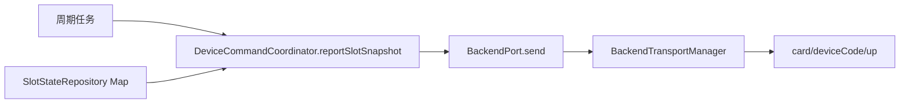
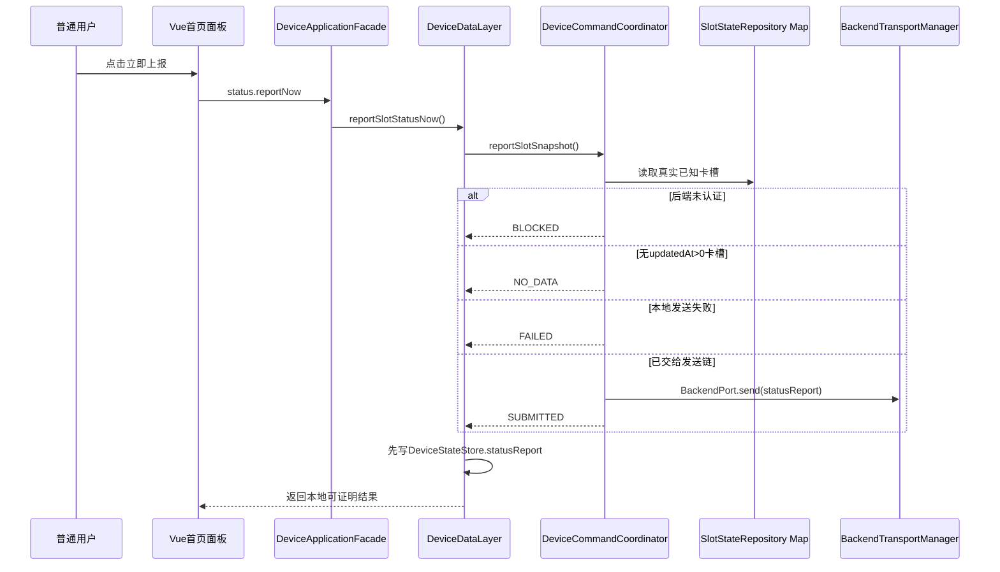

# ITEM-01：公开UI入口与MQTT状态上报——专项审计

状态：已完成审计，允许进入本子项实现；人员/人脸/指纹同步不在本批实现。

## 1. 用户确认

用户已确认：

- 接受首页Header公开入口；
- 先补MQTT实时状态上报；
- 每一项实施前必须重新审计并确认边界、docs和AGENTS。

本子项仅实现：

```text
首页公开入口
→ 打开状态上报面板
→ 手动立即触发一次现有statusReport链
→ 展示客户端可证明的结果
```

## 2. 所有权边界

### 允许修改

- `AGENTS.md`与`docs/CODE_OWNERSHIP.md`；
- `uniapp/src/components/CabinetHeader.vue`；
- `uniapp/src/pages/index/index.vue`；
- `uniapp/src/services/index.js`；
- `uniapp/src/App.vue`；
- `uniapp/src/mock/data.js`；
- `app/src/main/java/com/xingyao/card/core/NativeActionPolicy.java`；
- `app/src/main/java/com/xingyao/card/core/DeviceApplicationFacade.java`；
- `app/src/main/java/com/xingyao/card/core/DeviceDataLayer.java`；
- `app/src/main/java/com/xingyao/card/core/DeviceStateStore.java`；
- `app/src/main/java/com/xingyao/card/core/DeviceCommandCoordinator.java`；
- 对应客户端测试。

### 禁止修改

- `BackendTransportManager.java`；
- `BackendHttpGateway.java`；
- `BackendHttpClient.java`；
- 后端服务端；
- `serialport/**`、`serial-debug/**`、`app/libs/**`；
- `SerialConnectionManager.java`、`WorkCardProtocol.java`；
- FaceAISDK与CameraX负责人文件。

## 3. 契约证据

V4.1定义MQTT上行：

```text
cmd = statusReport
data = { slots: [...] }
```

slot元素只允许：

```text
slotId
status
cardNo
voltage
current
chargeStatus
faultCode
```

外层`msgId/cmd/timestamp/deviceCode/sign/data`继续由后端通信负责人现有`BackendTransportManager`生成。本子项不得在Vue、Facade或数据层自行构造签名Envelope。

## 4. 当前调用链



当前问题：

1. 只有周期调用，没有公开立即触发入口；
2. `reportSlotSnapshot()`返回`void`；
3. 未认证、无已知卡槽和发送失败均只静默返回或写日志；
4. Vue无法区分“未发送”“已提交到发送链”和“服务端确认”；
5. 底层只向上层公开响应摘要，没有公开`statusReportResp.code/msg`。

## 5. 目标调用链



## 6. 状态语义

只新增客户端本地状态节`statusReport`，不进入外部报文。

| state | 含义 | 是否可显示“服务端成功” |
|---|---|---|
| `IDLE` | 尚未手动触发 | 否 |
| `SUBMITTING` | 正在进入客户端上报链 | 否 |
| `BLOCKED` | 后端业务会话未认证 | 否 |
| `NO_DATA` | 没有`updatedAt > 0`的真实卡槽 | 否 |
| `SUBMITTED` | `BackendPort.send()`未抛错，已交给现有发送链 | 否 |
| `FAILED` | 客户端本地发送失败 | 否 |

允许字段：

```text
state
message
knownSlotCount
requestedAt
submittedAt
failedAt
```

这些字段仅保存在Android状态节和Vue展示投影中，不进入MQTT payload。

## 7. UI方案

首页Header管理员图标左侧增加可发现的同步/上报图标。

点击后打开状态面板。第一批面板只包含：

- 后端当前连接/认证状态；
- 最近一次状态上报本地结果；
- 已知卡槽数量；
- “立即上报卡槽状态”按钮；
- 说明“提交到发送链不等于服务端确认”。

人员、人脸和指纹同步按钮本批不显示，必须在各自专项审计通过后再加入。

## 8. 最小实现方案

### 8.1 Android客户端

1. `NativeActionPolicy`将`status.reportNow`列为可信WebView公开动作；
2. Facade仅转发到`DeviceDataLayer.reportSlotStatusNow()`；
3. `DeviceCommandCoordinator.reportSlotSnapshot()`改为返回本地结果对象；
4. 周期任务使用安全包装，保持原周期行为；
5. DataLayer先写`SUBMITTING`，再写最终状态；
6. `DeviceStateStore`增加`statusReport`默认节。

### 8.2 Vue

1. `services.reportStatusNow()`只调用Bridge；
2. `App.vue`监听`status.reportChanged`；
3. `defaultRuntime`增加`statusReport`默认投影；
4. Header增加入口；
5. 首页增加状态面板并显示真实语义。

## 9. 必须保持不变

- 现有周期上报继续保留；
- 不改变10000毫秒本地默认值；
- 只发送`updatedAt > 0`的卡槽；
- 不修改MQTT Topic、QoS、签名和Envelope；
- 不新增事件驱动上报或防抖策略；
- 不把`SUBMITTED`显示为服务端ACK成功；
- 不触碰人员、人脸和指纹同步实现；
- 不触碰串口负责人代码。

## 10. 文件修改矩阵

| 文件 | 动作 | 原因 |
|---|---|---|
| `NativeActionPolicy.java` | 修改 | 增加公开客户端动作 |
| `DeviceApplicationFacade.java` | 修改 | 转发立即上报 |
| `DeviceDataLayer.java` | 修改 | 维护本地状态节并调用已有协调器 |
| `DeviceStateStore.java` | 修改 | 初始化`statusReport`状态 |
| `DeviceCommandCoordinator.java` | 修改 | 返回本地可证明的上报结果，保留周期安全调用 |
| `NativeActionPolicyTest.java` | 修改 | 验证公开动作 |
| `DeviceCommandCoordinatorTest.java` | 新增或修改 | 验证未认证、无数据、提交与失败 |
| `services/index.js` | 修改 | 增加Bridge调用 |
| `App.vue` | 修改 | 消费状态事件 |
| `mock/data.js` | 修改 | 增加默认投影，不模拟真实成功 |
| `CabinetHeader.vue` | 修改 | 增加公开入口 |
| `pages/index/index.vue` | 修改 | 增加状态面板 |

设计外运行代码文件不得修改。

## 11. 验收标准

- `AC-SR-001`：未登录管理员时可打开状态面板；
- `AC-SR-002`：点击只调用`status.reportNow`，Vue无MQTT代码；
- `AC-SR-003`：未认证时显示`BLOCKED`；
- `AC-SR-004`：无真实卡槽时显示`NO_DATA`且不发送；
- `AC-SR-005`：有真实卡槽且本地发送成功时显示`SUBMITTED`；
- `AC-SR-006`：发送异常时显示`FAILED`；
- `AC-SR-007`：任何状态都不显示“服务端确认成功”；
- `AC-SR-008`：周期上报逻辑仍存在；
- `AC-SR-009`：最终diff不包含后端底层、串口和人脸负责人文件；
- `AC-SR-010`：前端语法、H5、Android单测和Debug APK通过。

## 12. 审计结论

本子项可以在客户端边界内完成，不需要修改后端通信底层或串口负责人代码。用户已确认UI入口与状态上报方向，因此该子项完成本审计后可进入实现。