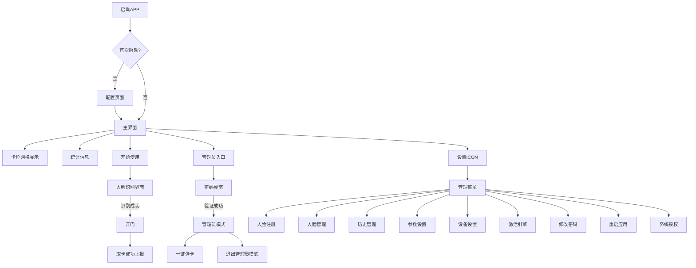

# 智能工卡发卡机APP功能模块清单

## 一、文档说明

| 项目 | 内容 |
|------|------|
| 文档名称 | 智能工卡发卡机APP功能模块清单 |
| 版本号 | V1.0 |
| 创建日期 | 2026-06-14 |
| 关联需求文档 | 智能工卡发卡机设备APP需求文档 V1.1 |

---

## 二、功能模块清单总览

| 模块类别 | 功能数量 | 说明 |
|----------|----------|------|
| 基础功能 | 4 | 设备网络、自启动、定时开关机、应用管理 |
| APP配置功能 | 14 | 首次启动配置项 |
| 主界面功能 | 5 | 卡位展示、管理员入口、人脸识别等 |
| 管理员模式功能 | 3 | 一键弹卡、退出管理员模式等 |
| 管理界面功能 | 11 | 人脸注册、人脸管理、参数设置等 |
| 人脸识别功能 | 2 | 人脸采集、识别开门 |
| 指纹识别功能 | 4 | 指纹采集、识别开门、指纹注册、指纹管理 |
| 卡位详情功能 | 8 | 卡号、状态、电压电流等信息展示 |
| 通信功能 | 13 | HTTP、TCP、串口通信接口 |
| 异常处理功能 | 4 | 异常捕获、日志存储、超时处理等 |
| 非功能性需求 | 7 | 启动方式、响应时间、并发支持等 |

---

## 三、功能模块详细清单

### 3.1 基础功能

| 编号 | 功能名称 | 功能描述 | 需求来源 |
|------|----------|----------|----------|
| F001 | 设备网络 | 支持有线/无线网络连接，支持静态IP配置，适用于内网环境 | 需求文档 3.1 |
| F002 | 自启动 | 开机自动启动APP，支持设置为系统自启动应用 | 需求文档 3.1 |
| F003 | 定时开关机 | 设备定时开关机功能，开关机时间需间隔≥5分钟 | 需求文档 3.1 |
| F004 | 应用管理 | 支持将应用图标拖动到桌面进行管理 | 需求文档 3.1 |

### 3.2 APP配置功能（首次启动）

| 编号 | 功能名称 | 功能描述 | 默认值 | 需求来源 |
|------|----------|----------|--------|----------|
| F005 | 波特率配置 | 串口通信波特率设置 | 57600 | 需求文档 3.2 |
| F006 | 单组数量配置 | 小主板分组数量设置 | 10（或2） | 需求文档 3.2 |
| F007 | 总体数量配置 | 卡槽总数设置 | 100 | 需求文档 3.2 |
| F008 | 卡号解析配置 | 卡号解析方式设置 | 转可见符 | 需求文档 3.2 |
| F009 | 轮询方式配置 | 卡位轮询策略设置 | 单组轮询 | 需求文档 3.2 |
| F010 | 设备ID配置 | 设备唯一标识，默认Android ID，可自定义 | Android ID | 需求文档 3.2 |
| F011 | 服务器IP配置 | 服务器地址及后缀路径配置 | - | 需求文档 3.2 |
| F012 | TCP端口配置 | TCP通信端口设置 | 9009 | 需求文档 3.2 |
| F013 | HTTP端口配置 | HTTP通信端口设置 | 8081 | 需求文档 3.2 |
| F014 | 人脸识别阈值配置 | 人脸识别相似度阈值设置，范围0.6-0.9 | 0.9 | 需求文档 3.2 |
| F015 | 镜头旋转角度配置 | 摄像头旋转角度设置 | 270°（竖屏） | 需求文档 3.2 |
| F016 | Token获取配置 | 可配置是否忽略Token获取 | - | 需求文档 3.2 |
| F017 | 授权状态管理 | 设备授权状态显示及在线授权（10年有效期） | - | 需求文档 3.2 |
| F018 | 人脸引擎激活 | 支持在线/离线激活，需填写APP_ID、SDK_KEY、ACTIVE_KEY | - | 需求文档 3.2 |

### 3.3 主界面功能

| 编号 | 功能名称 | 功能描述 | 需求来源 |
|------|----------|----------|----------|
| F019 | 卡位网格展示 | 展示1~100号卡位状态（空/充电中/已充满/故障等），10列×10行布局 | 需求文档 3.3 |
| F020 | 卡位详情查看 | 点击柜门号显示卡位详细信息（卡号、电量、状态等） | 需求文档 3.3 |
| F021 | 管理员入口 | 点击ICON按钮，输入密码进入管理员模式（默认密码：123456） | 需求文档 3.3 |
| F022 | 人脸识别启动 | 点击【开始使用】按钮启动人脸识别流程 | 需求文档 3.3 |
| F023 | 统计信息展示 | 显示空柜、充电中、已充满、故障等数量统计 | 需求文档 3.3 |

### 3.4 管理员模式功能

| 编号 | 功能名称 | 功能描述 | 需求来源 |
|------|----------|----------|----------|
| F024 | 一键弹卡 | 弹出所有卡片，需二次确认，操作不可撤销 | 需求文档 3.4 |
| F025 | 退出管理员模式 | 点击退出按钮退出管理员模式 | 需求文档 3.4 |
| F026 | 独立操作权限 | 管理员操作不受服务器参数限制 | 需求文档 3.4 |

### 3.5 管理界面功能（管理员菜单）

| 编号 | 功能名称 | 功能描述 | 需求来源 |
|------|----------|----------|----------|
| F027 | 人脸注册 | 下发/注册人脸信息到设备 | 需求文档 3.5 |
| F028 | 人脸管理 | 查看已下发人员列表，支持搜索和新增 | 需求文档 3.5 |
| F029 | 单元管理 | 预留功能，用于管理设备单元 | 需求文档 3.5 |
| F030 | 历史管理 | 查看开门/还卡记录（仅供参考） | 需求文档 3.5 |
| F031 | 参数设置 | 调整人脸识别引擎参数 | 需求文档 3.5 |
| F032 | 设备设置 | 修改设备ID、卡位数量等，需保存后重启生效 | 需求文档 3.5 |
| F033 | 激活引擎 | 激活人脸识别引擎 | 需求文档 3.5 |
| F034 | 修改密码 | 修改管理员登录密码 | 需求文档 3.5 |
| F035 | 重启应用 | 重启APP使其配置生效 | 需求文档 3.5 |
| F036 | 系统授权 | 设备授权操作界面 | 需求文档 3.5 |
| F037 | 返回首页 | 返回到卡位列表主界面 | 需求文档 3.5 |

### 3.6 人脸识别功能

| 编号 | 功能名称 | 功能描述 | 需求来源 |
|------|----------|----------|----------|
| F038 | 人脸采集识别 | 实时采集人脸图像并进行识别比对 | 需求文档 3.3.7 |
| F039 | 识别结果处理 | 识别成功→打开对应柜门→显示成功提示；识别失败→显示失败原因→可重试 | 需求文档 3.3.7 |

### 3.7 卡位详情功能

| 编号 | 功能名称 | 功能描述 | 需求来源 |
|------|----------|----------|----------|
| F040 | 柜门号显示 | 显示卡位编号（01-100） | 需求文档 4.3.9 |
| F041 | 卡号显示 | 显示当前卡位的工卡号码 | 需求文档 4.3.9 |
| F042 | 工作状态显示 | 显示卡位工作状态（正常/故障） | 需求文档 4.3.9 |
| F043 | 在位状态显示 | 显示卡位在位状态（有卡/无卡） | 需求文档 4.3.9 |
| F044 | 卡状态显示 | 显示卡状态（正常/非法） | 需求文档 4.3.9 |
| F045 | 故障码显示 | 显示故障码信息 | 需求文档 4.3.9 |
| F046 | 电压显示 | 显示当前电压值（单位：V） | 需求文档 4.3.9 |
| F047 | 电流显示 | 显示当前电流值（单位：A） | 需求文档 4.3.9 |

### 3.8 通信功能

#### 3.8.1 HTTP接口

| 编号 | 功能名称 | 接口地址 | 请求方法 | 功能描述 | 需求来源 |
|------|----------|----------|----------|----------|----------|
| F048 | 获取Token | /api/getToken | POST | 获取身份认证Token | 需求文档 6.1 |
| F049 | 取卡请求 | /api/takeCard | POST | 发起取卡请求 | 需求文档 6.1 |
| F050 | 取卡成功上报 | /api/takeSuccess | POST | 上报取卡成功事件 | 需求文档 6.1 |
| F051 | 还卡上报 | /api/saveCard | POST | 上报还卡事件 | 需求文档 6.1 |

#### 3.8.2 TCP接口

| 编号 | 功能名称 | 功能描述 | 需求来源 |
|------|----------|----------|----------|
| F052 | 设备登录 | 设备向服务器发送登录请求 | 需求文档 6.2 |
| F053 | 人员下发 | 服务器下发人脸/人员信息 | 需求文档 6.2 |
| F054 | 远程开锁 | 服务器下发开门指令 | 需求文档 6.2 |
| F055 | 人员删除 | 服务器下发删除指令 | 需求文档 6.2 |
| F056 | 卡状态上报 | 设备主动上报卡位状态 | 需求文档 6.2 |
| F057 | 心跳包 | 设备定期发送心跳（code:111） | 需求文档 6.2 |

#### 3.8.3 串口通信

| 编号 | 功能名称 | 功能码 | 功能描述 | 需求来源 |
|------|----------|--------|----------|----------|
| F058 | 查询数据 | 0x01 | 查询卡位状态信息（工作状态、在位状态、卡状态、卡号、故障、电压、电流） | 需求文档 5.3 |
| F059 | 开门控制 | 0x51 | 发卡开门/管理员开门控制 | 需求文档 5.4 |
| F060 | LED亮度控制 | 0x52 | 设置LED占空比（30~100） | 需求文档 5.5 |
| F061 | 读取版本号 | 0x53 | 读取硬件/软件版本信息 | 需求文档 5.6 |
| F062 | 升级使能 | 0x80 | 使能单板升级模式 | 需求文档 5.7 |
| F063 | 升级程序传输 | 0x81 | 传输固件数据到单板 | 需求文档 5.8 |

### 3.9 异常处理功能

| 编号 | 功能名称 | 功能描述 | 需求来源 |
|------|----------|----------|----------|
| F064 | 异常捕获 | APP崩溃或ANR时自动记录异常信息 | 需求文档 7 |
| F065 | 本地存储 | 异常信息保存为 `/sdcard/crash_log.txt` | 需求文档 7 |
| F066 | 远程上报 | 公网环境下自动上报异常信息 | 需求文档 7 |
| F067 | 通信超时处理 | 串口通信超时时间100ms，超时后标记通信故障 | 需求文档 7 |

### 3.10 非功能性需求

| 编号 | 需求名称 | 需求描述 | 需求来源 |
|------|----------|----------|----------|
| N001 | 操作系统 | Android（竖屏优化） | 需求文档 8 |
| N002 | 启动方式 | 支持开机自启动 | 需求文档 8 |
| N003 | 响应时间 | 人脸识别+开门 < 3秒 | 需求文档 8 |
| N004 | 并发支持 | 支持多设备同时连接服务器 | 需求文档 8 |
| N005 | 授权机制 | 设备授权一次有效期10年 | 需求文档 8 |
| N006 | 日志存储 | 本地保留异常日志，便于调试 | 需求文档 8 |
| N007 | 串口通信参数 | 支持57600波特率，8数据位1停止位无校验 | 需求文档 8 |

---

## 四、功能模块关系图

---

## 五、统计信息

| 类别 | 功能数量 | 占比 |
|------|----------|------|
| 基础功能 | 4 | 5.88% |
| APP配置功能 | 14 | 20.59% |
| 主界面功能 | 5 | 7.35% |
| 管理员模式功能 | 3 | 4.41% |
| 管理界面功能 | 11 | 16.18% |
| 人脸识别功能 | 2 | 2.94% |
| 指纹识别功能 | 4 | 5.88% |
| 卡位详情功能 | 8 | 11.76% |
| 通信功能 | 13 | 19.12% |
| 异常处理功能 | 4 | 5.88% |
| **总计** | **68** | **100%** |

---

## 六、开发工作量评估

### 6.1 功能模块工作量估算

| 模块类别 | 功能数量 | 复杂度 | 估算工时（人天） | 说明 |
|----------|----------|--------|------------------|------|
| 基础功能 | 4 | 低 | 2 | 网络配置、自启动等系统级功能 |
| APP配置功能 | 14 | 中 | 8 | 参数配置界面、保存逻辑 |
| 主界面功能 | 5 | 中 | 6 | 卡位网格、统计展示 |
| 管理员模式功能 | 3 | 中 | 4 | 一键弹卡、权限控制 |
| 管理界面功能 | 11 | 中高 | 15 | 人脸/指纹注册管理、参数设置 |
| 人脸识别功能 | 2 | 高 | 12 | 人脸采集、识别引擎集成 |
| 指纹识别功能 | 4 | 高 | 16 | 指纹采集、识别引擎集成 |
| 卡位详情功能 | 8 | 低 | 4 | 信息展示、开门操作 |
| 通信功能 | 13 | 中高 | 20 | HTTP、TCP、串口通信实现 |
| 异常处理功能 | 4 | 低 | 3 | 日志记录、异常上报 |
| **总计** | **68** | - | **90** | 不含测试和联调时间 |

### 6.2 开发阶段划分

| 阶段 | 时间（人天） | 说明 |
|------|-------------|------|
| 需求分析 | 3 | 需求确认、方案设计 |
| 架构设计 | 2 | 技术选型、架构文档 |
| 前端开发 | 40 | Vue页面、组件开发 |
| Android开发 | 30 | JsBridge、串口通信 |
| 接口联调 | 10 | 与服务器对接 |
| 单元测试 | 8 | 功能模块测试 |
| 集成测试 | 5 | 系统联调测试 |
| Bug修复 | 5 | 线上问题修复 |
| **总计** | **103** | 含各阶段时间 |

### 6.3 资源需求评估

| 资源类型 | 数量 | 说明 |
|----------|------|------|
| 前端开发工程师 | 1 | Vue/uni-app开发 |
| Android开发工程师 | 1 | Java原生开发 |
| 测试工程师 | 1 | 功能测试 |
| 项目管理 | 0.5 | 需求跟进、进度管理 |
| **总计** | **3.5** | 人月资源 |

### 6.4 风险评估

| 风险项 | 风险等级 | 影响 | 应对措施 |
|--------|----------|------|----------|
| 人脸识别引擎集成 | 高 | 技术复杂度高 | 提前进行POC验证 |
| 指纹识别模块兼容性 | 中 | 硬件适配问题 | 选择成熟指纹模组 |
| 串口通信稳定性 | 中 | 数据传输异常 | 增加超时重连机制 |
| 网络环境差异 | 低 | 内网环境限制 | 支持静态IP配置 |

---

## 七、备注

1. 功能编号规则：
   - `F` 开头表示功能性需求
   - `N` 开头表示非功能性需求
   - 数字为顺序编号

2. 需求来源列对应需求文档中的章节号

3. 本清单基于《智能工卡发卡机设备APP需求文档 V1.1》整理