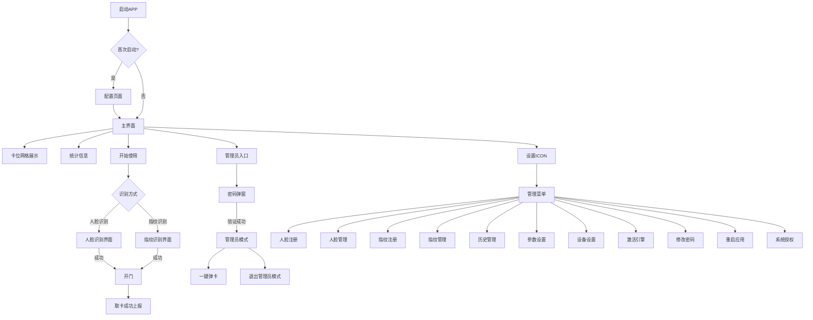

# 智能工卡发卡机系统完整需求文档

## 文档版本信息

| 项目 | 内容 |
|------|------|
| 文档名称 | 智能工卡发卡机系统完整需求文档 |
| 版本号 | V1.0 |
| 创建日期 | 2026-07-02 |
| 适用设备 | Android竖屏平板 |

---

## 一、项目概述

### 1.1 项目名称
智能工卡发卡机系统

### 1.2 项目背景
为满足企业或机构对工卡/工作卡的自助发放、归还、管理需求，开发一款运行于Android竖屏平板的发卡机控制APP及配套后台管理系统，支持人脸识别、指纹识别、远程管理、卡位状态监控等功能。

### 1.3 适用设备
- Android竖屏平板（Rockchip rk3568_r，分辨率适配：800×1280 / 1200*1920 分辨率）
- 支持人脸识别摄像头
- 支持指纹识别模块（电容/光学指纹传感器）
- 支持有线/无线网络连接
- 支持串口通信（与小主板交互）

### 1.4 系统架构

```
┌─────────────────────────────────────────────────────────────────────┐
│                         后台管理系统                                 │
│  ┌─────────────┐ ┌─────────────┐ ┌─────────────┐ ┌─────────────┐  │
│  │ 终端管理    │ │ 员工管理    │ │ 日志监控    │ │ 系统配置    │  │
│  └─────────────┘ └─────────────┘ └─────────────┘ └─────────────┘  │
└──────────────────────────┬──────────────────────────────────────────┘
                           │
          ┌────────────────┴────────────────┐
          │ HTTP / Socket长连接             │
          └────────────────┬────────────────┘
                           │
┌──────────────────────────▼──────────────────────────────────────────┐
│                        终端APP                                      │
│  ┌─────────────┐ ┌─────────────┐ ┌─────────────┐ ┌─────────────┐  │
│  │ 主界面      │ │ 配置管理    │ │ 生物识别    │ │ 通信模块    │  │
│  │ 卡位展示    │ │ 参数设置    │ │ 人脸/指纹   │ │ HTTP/TCP/串口│  │
│  └─────────────┘ └─────────────┘ └─────────────┘ └─────────────┘  │
└──────────────────────────┬──────────────────────────────────────────┘
                           │
          ┌────────────────┴────────────────┐
          │ 串口通信 (57600波特率)           │
          └────────────────┬────────────────┘
                           │
┌──────────────────────────▼──────────────────────────────────────────┐
│                        硬件单板                                      │
│  ┌─────────────────────────────────────────────────────────────┐    │
│  │  卡位单元 × 100  |  电机控制  |  LED控制  |  充电管理      │    │
│  └─────────────────────────────────────────────────────────────┘    │
└─────────────────────────────────────────────────────────────────────┘
```

---

## 二、终端APP功能需求

### 2.1 基础功能

| 功能编号 | 功能名称 | 功能描述 | 默认值/说明 |
|----------|----------|----------|-------------|
| F001 | 设备网络 | 支持有线/无线网络连接，支持静态IP配置，适用于内网环境 | - |
| F002 | 自启动 | 开机自动启动APP，支持设置为系统自启动应用 | 开启 |
| F003 | 定时开关机 | 设备定时开关机功能，开关机时间需间隔≥5分钟 | - |
| F004 | 系统级保活 | 防止APP被系统杀死 | 开启 |
| F005 | 应用管理 | 支持将应用图标拖动到桌面进行管理 | - |

### 2.2 APP配置功能（首次启动）

| 功能编号 | 功能名称 | 功能描述 | 默认值 |
|----------|----------|----------|--------|
| F006 | 波特率配置 | 串口通信波特率设置 | 57600 |
| F007 | 单组数量配置 | 小主板分组数量设置 | 10（或2） |
| F008 | 总体数量配置 | 卡槽总数设置 | 100 |
| F009 | 卡号解析配置 | 卡号解析方式设置 | 转可见符 |
| F010 | 轮询方式配置 | 卡位轮询策略设置 | 单组轮询 |
| F011 | 设备ID配置 | 设备唯一标识，默认Android ID，可自定义 | Android ID |
| F012 | 服务器IP配置 | 服务器地址及后缀路径配置 | - |
| F013 | TCP端口配置 | TCP通信端口设置 | 9009 |
| F014 | HTTP端口配置 | HTTP通信端口设置 | 8081 |
| F015 | 人脸识别阈值配置 | 人脸识别相似度阈值设置，范围0.6-0.9 | 0.9 |
| F016 | 镜头旋转角度配置 | 摄像头旋转角度设置 | 270°（竖屏） |
| F017 | Token获取配置 | 可配置是否忽略Token获取 | - |
| F018 | 授权状态管理 | 设备授权状态显示及在线授权（10年有效期） | - |
| F019 | 人脸引擎激活 | 支持在线/离线激活，需填写APP_ID、SDK_KEY、ACTIVE_KEY | - |
| F020 | 指纹识别模式 | 默认关闭，可开启指纹取卡功能 | 关闭 |
| F021 | 指纹识别阈值 | 默认0.8，可调范围0.5-0.95 | 0.8 |

### 2.3 主界面功能

| 功能编号 | 功能名称 | 功能描述 |
|----------|----------|----------|
| F022 | 卡位网格展示 | 10×10网格展示100个卡位状态（颜色区分：空/充电中/已充满/故障） |
| F023 | 卡位详情查看 | 点击柜门号显示卡位详细信息（卡号、电量、状态、电压、电流等） |
| F024 | 管理员入口 | 点击ICON按钮，输入密码进入管理员模式（默认密码：123456） |
| F025 | 人脸识别启动 | 点击【开始使用】按钮启动人脸识别流程 |
| F026 | 指纹识别启动 | 点击【开始使用】按钮启动指纹识别流程（根据配置选择） |
| F027 | 统计信息展示 | 显示空柜、充电中、已充满、故障等数量统计 |

### 2.4 管理员模式功能（需密码进入）

| 功能编号 | 功能名称 | 功能描述 |
|----------|----------|----------|
| F028 | 一键弹卡 | 弹出所有卡片，需二次确认，操作不可撤销 |
| F029 | 退出管理员模式 | 点击退出按钮退出管理员模式 |
| F030 | 独立操作权限 | 管理员操作不受服务器限制，支持多管理员角色（管理员/维护/开发） |

### 2.5 管理界面功能（管理员菜单）

| 功能编号 | 功能名称 | 功能描述 |
|----------|----------|----------|
| F031 | 人脸注册 | 下发/注册人脸信息到设备 |
| F032 | 人脸管理 | 查看已下发人员列表，支持搜索和新增 |
| F033 | 指纹注册 | 下发/注册指纹信息到设备 |
| F034 | 指纹管理 | 查看已注册指纹人员列表，支持搜索和删除 |
| F035 | 单元管理 | 预留功能，用于管理设备单元 |
| F036 | 历史管理 | 查看开门/还卡记录（仅供参考） |
| F037 | 参数设置 | 调整人脸识别引擎参数 |
| F038 | 设备设置 | 修改设备ID、卡位数量等，需保存后重启生效 |
| F039 | 激活引擎 | 激活人脸识别引擎 |
| F040 | 修改密码 | 修改管理员登录密码 |
| F041 | 重启应用 | 重启APP使其配置生效 |
| F042 | 系统授权 | 设备授权操作界面 |
| F043 | 返回首页 | 返回到卡位列表主界面 |

### 2.6 人脸识别功能

| 功能编号 | 功能名称 | 功能描述 |
|----------|----------|----------|
| F044 | 人脸采集识别 | 实时采集人脸图像并进行识别比对（虹软SDK） |
| F045 | 人脸识别SDK接入 | 集成虹软人脸识别SDK |
| F046 | 识别结果处理 | 识别成功→打开对应柜门→显示成功提示；识别失败→显示失败原因→可重试 |

### 2.7 指纹识别功能

| 功能编号 | 功能名称 | 功能描述 |
|----------|----------|----------|
| F047 | 指纹采集识别 | 实时采集指纹图像并进行识别比对 |
| F048 | 指纹识别SDK接入 | 接入指纹识别SDK |
| F049 | 指纹识别结果处理 | 识别成功→打开对应柜门→显示成功提示；识别失败→显示失败原因→可重试 |

### 2.8 卡位详情功能

| 功能编号 | 功能名称 | 功能描述 |
|----------|----------|----------|
| F050 | 柜门号显示 | 显示卡位编号（01-100） |
| F051 | 卡号显示 | 显示当前卡位的工卡号码 |
| F052 | 工作状态显示 | 显示卡位工作状态（正常/故障） |
| F053 | 在位状态显示 | 显示卡位在位状态（有卡/无卡） |
| F054 | 卡状态显示 | 显示卡状态（正常/非法） |
| F055 | 故障码显示 | 显示故障码信息 |
| F056 | 电压显示 | 显示当前电压值（单位：V） |
| F057 | 电流显示 | 显示当前电流值（单位：A） |

### 2.9 通信功能

| 功能编号 | 功能名称 | 功能描述 |
|----------|----------|----------|
| F058 | HTTP取卡请求 | POST /api/takeCard |
| F059 | HTTP取卡成功上报 | POST /api/takeSuccess |
| F060 | HTTP还卡上报 | POST /api/saveCard |
| F061 | HTTP获取Token | POST /api/getToken |
| F062 | HTTP设备激活 | POST /api/v1/device/activate |
| F063 | HTTP激活验证 | POST /api/v1/device/verify |
| F064 | HTTP配置拉取 | GET /api/v1/device/config |
| F065 | Socket设备登录 | 设备向服务器发送登录请求 |
| F066 | Socket人员同步 | 服务器下发人脸/指纹人员信息 |
| F067 | Socket远程开锁 | 服务器下发开门指令 |
| F068 | Socket卡状态上报 | 设备主动上报卡位状态 |
| F069 | Socket心跳包 | 设备定期发送心跳（间隔30s） |
| F070 | 串口查询数据 | 功能码0x01，查询卡位状态 |
| F071 | 串口开门控制 | 功能码0x51，发卡/管理员开门 |
| F072 | 串口LED控制 | 功能码0x52，设置LED亮度 |
| F073 | 串口版本读取 | 功能码0x53，读取版本号 |
| F074 | 串口升级使能 | 功能码0x80，使能升级模式 |
| F075 | 串口升级传输 | 功能码0x81，传输固件数据 |

### 2.10 异常处理功能

| 功能编号 | 功能名称 | 功能描述 |
|----------|----------|----------|
| F076 | 异常捕获 | APP崩溃或ANR时自动记录异常信息 |
| F077 | 本地存储 | 异常信息保存为 `/sdcard/crash_log.txt` |
| F078 | 远程上报 | 公网环境下自动上报异常信息 |
| F079 | 通信超时处理 | 串口通信超时时间100ms，超时后标记通信故障 |

---

## 三、后台管理系统功能需求

### 3.1 整体框架

| 功能编号 | 功能名称 | 功能描述 |
|----------|----------|----------|
| B001 | 后台登录 | 管理员登录，支持密码验证 |
| B002 | 角色权限 | 多角色权限控制（管理员/维护人员/开发人员） |
| B003 | 系统配置 | 系统全局参数配置 |

### 3.2 终端管理

| 功能编号 | 功能名称 | 功能描述 |
|----------|----------|----------|
| B004 | 终端列表 | 增删查改终端信息，支持搜索和分页 |
| B005 | 生成注册码 | 每个终端录入设备ID后生成注册码，注册码正确才可正常通信 |
| B006 | 下发指令 | 直接下发指令给终端执行（远程开门、一键弹卡等） |
| B007 | 实时通信日志 | 实时查看终端通信的消息指令 |
| B008 | 终端操作日志 | 终端操作和网络交互的全部日志记录（保留1个月） |
| B009 | 激活码管理 | 虹软人脸识别激活码信息管理，记录终端使用情况 |
| B010 | 设备管理员 | 每个设备允许3个管理员密码，分别对应不同角色 |
| B011 | 取卡/还卡记录 | 查看所有取还卡记录 |
| B012 | 实时状态查询 | 查询终端实时卡位状态 |

### 3.3 员工管理

| 功能编号 | 功能名称 | 功能描述 |
|----------|----------|----------|
| B013 | 员工基础信息 | 增删查改员工数据，支持添加人脸/指纹录入和查看 |
| B014 | 人脸识别库 | 管理员工-人脸-设备三者关系 |
| B015 | 指纹识别库 | 管理员工-指纹-设备三者关系 |

### 3.4 Socket通信管理

| 功能编号 | 功能名称 | 功能描述 |
|----------|----------|----------|
| B016 | 基础协议管理 | 管理登入/登出/心跳等通信基础 |
| B017 | 指令下发协议 | 同步人员和生物特征、远程发卡、实时状态查询 |
| B018 | 上报协议管理 | 实时状态上报、取还卡上报、终端日志上报 |

---

## 四、界面设计

### 4.1 设计规范

| 项目 | 规范 |
|------|------|
| 屏幕方向 | 竖屏固定 |
| 分辨率适配 | 1280×800 / 1920×1200 |
| 主色调 | 科技蓝 #1E88E5 |
| 背景色 | 浅灰 #F5F7FA / 白色 #FFFFFF |
| 字体 | 思源黑体 / Roboto |
| 圆角 | 卡片圆角 16dp |

### 4.2 卡位状态颜色标识

| 状态 | 颜色 | 说明 |
|------|------|------|
| 空 | 🟢 绿色 | 卡位空闲 |
| 充电中 | 🟡 橙色 | 正在充电 |
| 已充满 | ✅ 蓝色 | 充电完成 |
| 故障 | 🔴 红色 | 硬件故障 |
| 通信故障 | ⚪ 灰色 | 通信异常 |
| 非法卡 | ⚠️ 黄色 | 卡状态异常 |

### 4.3 页面流程图



---

## 五、非功能性需求

| 需求编号 | 需求名称 | 需求描述 |
|----------|----------|----------|
| N001 | 操作系统 | Android 11（SDK 30），竖屏优化 |
| N002 | 启动方式 | 支持开机自启动 |
| N003 | 响应时间 | 人脸识别+开门 < 3秒；指纹识别+开门 < 2秒 |
| N004 | 并发支持 | 支持多设备同时连接服务器 |
| N005 | 授权机制 | 设备授权一次有效期10年 |
| N006 | 日志存储 | 本地保留异常日志，便于调试 |
| N007 | 串口通信参数 | 支持57600波特率，8数据位1停止位无校验 |
| N008 | 通信超时 | 串口通信超时100ms |
| N009 | 分辨率适配 | 支持800×1280及以上分辨率 |

---

## 六、交付物

- 可安装APK安装包
- 设备端配置说明文档
- 服务器端接口文档（用于对接）
- 串口通信协议文档
- 异常日志分析说明

---

## 七、文档说明

1. 功能编号规则：
   - `F` 开头表示终端APP功能性需求
   - `B` 开头表示后台管理系统功能性需求
   - `N` 开头表示非功能性需求
   - 数字为顺序编号

2. 本需求文档基于以下文档整理：
   - 智能工卡发卡机设备APP需求文档 V1.1
   - 发卡机功能模块清单.xlsx
   - 需求文档初稿.txt
