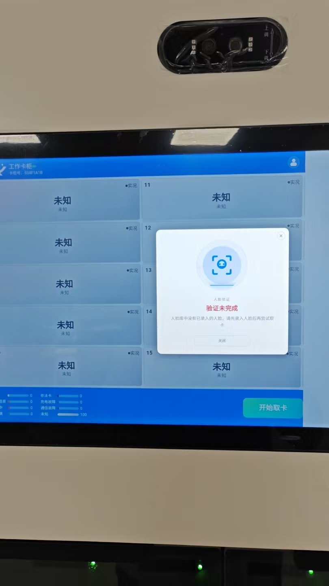
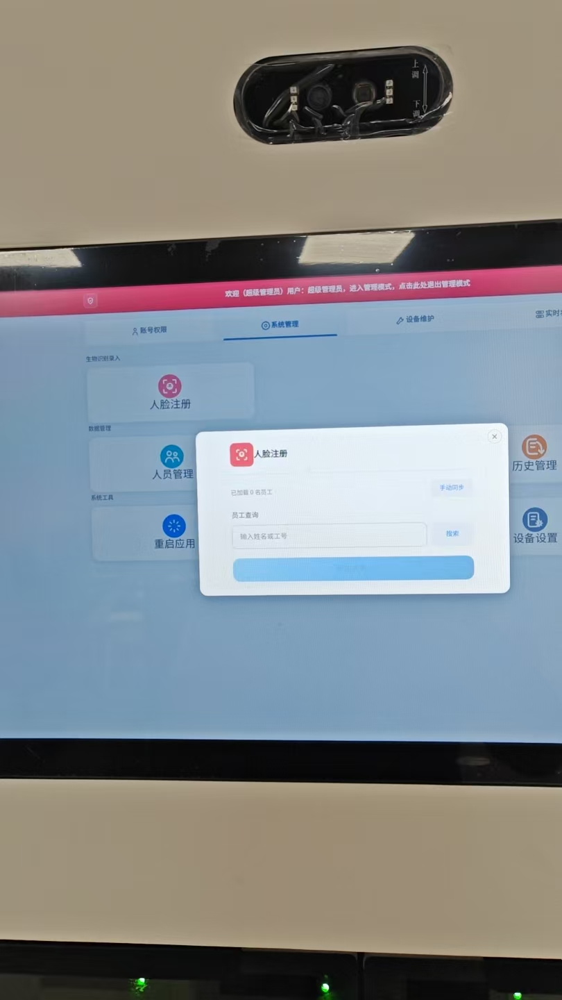

# 工作卡柜设备操作手册（现场小白版）

适用对象：第一次使用设备的员工、现场管理员和维护人员。

这份手册只说明“在屏幕上怎么操作”。看不到的菜单通常是当前账号没有权限，不是设备坏了；不要借用别人的账号，也不要在纸上、照片里或聊天工具中记录密码、人脸照片、激活码或其他隐私信息。

## 一、先认识设备：屏幕上最重要的三个位置

1. **右上角人员图标**：管理员从这里登录。
2. **卡槽列表**：每一个编号对应柜体上的一个卡槽；页面显示的是卡槽状态，不要用屏幕编号猜测柜门是否已经打开。
3. **“开始取卡”按钮**：员工领工卡从这里开始。

图 1 为现场界面示意。不同设备中的卡槽数量和编号可能不同；始终以当前屏幕显示的卡槽编号为准。

## 二、任何人操作前都要做的检查

按下面顺序检查，全部正常后再操作：

1. 确认设备已通电，屏幕不是黑屏，也没有停在系统桌面。
2. 等待设备自动进入首页。不要在开机过程反复点击屏幕或反复断电。
3. 看首页顶部：能看到设备名称或卡柜号即可继续；若持续显示未配置、启动失败或通信异常，先联系管理员。
4. 看摄像头区域：不要贴遮挡贴纸，镜头前不要有纸箱、手或强反光。
5. 开柜、取卡或维护前，确认手、衣物和工具远离柜门活动区域。

> **请先停一下**：如果有人正在识别、取卡、录入人脸或升级，请不要替他再次点击同一个按钮。等待当前提示结束，或通知管理员处理。

## 三、员工怎么领工卡

### 3.1 操作前确认

- 你已经完成人脸注册；第一次使用或换脸后未同步，可能无法识别。
- 人脸正对摄像头，摘下会严重遮挡脸部的物品，保持光线充足。
- 需要领取工卡时才点击按钮；不要把“开始取卡”当作测试按钮。

### 3.2 四步完成取卡

1. 在首页底部右侧点击 **“开始取卡”**。
2. 屏幕出现识别提示后，站到摄像头正前方，脸部完整进入识别范围，保持 1 至 2 秒。
3. 听从屏幕提示。验证通过后，设备会自动挑选当前可用工卡并开始开卡；此时不要再点击“开始取卡”。
4. 当屏幕提示已开卡、请取卡或显示卡槽编号时，到**对应编号**的柜门前取出工卡，然后把柜门关好。

### 3.3 怎样算完成，哪些情况必须停下

| 你在屏幕上看到的内容 | 代表什么 | 你应该怎么做 |
| --- | --- | --- |
| “识别成功”“正在为您出卡” | 系统已通过人脸验证，正在处理取卡。 | 等待下一条提示，不要再次点击。 |
| 显示卡槽编号或“请取卡” | 系统已给出本次要去的柜门。 | 到该编号的柜门取卡，并确认柜门关好。 |
| “验证未完成”“识别失败” | 本次没有通过人脸验证。 | 退出识别，调整站位、光线或清洁镜头后只重试一次；仍失败就联系管理员。 |
| “未登记人脸” | 该人员还不能用人脸取卡。 | 联系管理员录入人脸，不要借用他人脸部识别。 |
| “无可用工卡” | 当前没有可领取的可用工卡。 | 不要反复重试，联系管理员检查卡槽和工卡。 |
| 长时间没有新提示 | 设备可能正在处理或通信异常。 | 保持现场安全，等待约 30 秒；仍无结果，记录时间和屏幕提示后联系管理员。 |

## 四、管理员怎样进入和退出管理界面

### 4.1 登录

1. 在首页点击右上角的**人员图标**。
2. 出现密码输入框后，输入已分配给你的本机登录密码。
3. 如果提示“需要修改初始密码”，先按照页面要求完成修改；修改完成后再返回管理功能。
4. 登录成功后会进入管理员主页。首页没有出现管理员主页，说明密码错误、权限不足或会话已过期，应停止尝试并联系设备负责人。

### 4.2 退出

完成管理工作后，点击顶部或页面中的**退出**入口，确认回到员工首页。离开设备前必须退出，避免后续人员继续使用管理员权限。

### 4.3 看懂管理员主页

管理员主页通常有四个页签；看不到某个页签是正常的权限控制。

| 页签 | 给谁用 | 能做什么 |
| --- | --- | --- |
| 账号权限 | 被授权的账号管理员 | 查看或维护角色、用户和当前账号密码。 |
| 系统管理 | 日常管理员 | 人员、人脸、历史记录、设备设置、系统授权和重启应用。 |
| 设备维护 | 经过培训的维护人员 | 一键弹出、升级、版本信息和串口调试。 |
| 实时状态 | 管理员、维护人员 | 查看卡槽状态和设备通信状态。 |

## 五、管理员怎样给员工录入人脸

人脸录入必须由被录入的员工本人到场完成。屏幕提示“添加成功”只表示服务器已经确认；退出管理员模式后的同步会把正式人脸信息更新到本机。

图 2 中先在“员工查询”输入姓名或工号，点击“搜索”，再从结果中选择员工；不要在未选中员工时点击底部提交按钮。

### 5.1 录入步骤

1. 以管理员身份进入 **系统管理 → 人脸注册**。如果你是从人员详情进入，系统会自动带入该员工。
2. 在“员工查询”输入员工**姓名或工号**，点击“搜索”。
3. 在搜索结果中核对姓名和工号，点击正确的员工。若同名，必须以工号为准。
4. 确认页面显示“已选择员工”。如果员工被停用，先由有权限的管理员恢复其使用状态，不能继续录入。
5. 点击 **“添加人脸”** 或 **“重新录入人脸”**。
6. 请员工正对摄像头，脸部完整进入识别框，避免边走边录、逆光和多人同时进入画面。
7. 等待页面给出明确结果：看到“添加成功”后，点击“完成”关闭窗口；失败时不要把失败当成功，也不要连续提交。
8. 管理员退出管理模式后，保持网络正常，等待系统完成后续同步。以后员工即可按“员工取卡”流程使用。

### 5.2 录入失败时怎么做

- **搜索不到员工**：先检查姓名/工号，再在人员管理中手动同步人员列表；仍没有则联系后台人员管理员。
- **采集画面提示不合格**：请员工站正、移开遮挡物、补充正面光线，再重新开始一次。
- **提交失败或网络异常**：不要反复连续点“添加人脸”；记下页面提示和员工工号，待网络恢复后由管理员重新执行一次。
- **退出后仍不能识别**：先确认员工没有被停用，再让管理员检查人脸同步状态；不要用其他员工替代验证。

## 六、人员管理：新增、修改、停用和恢复

进入 **系统管理 → 人员管理** 后，先使用搜索框按姓名、工号或部门查找。右上角的“手动同步”用于从服务端刷新人员列表；它不是新增人员按钮。

### 6.1 新增人员

1. 点击 **“新增人员”**。
2. 按表单填写员工编码、姓名、部门和手机号。其中姓名为必填项，部门必须从可选的授权部门中选择。
3. 点击 **“保存人员”**，等待“保存成功”提示。
4. 新增成功后，进入该员工详情，确认信息无误，再按第五章录入人脸。

### 6.2 修改人员

1. 点击人员卡片，进入“人员详情”。
2. 核对姓名、工号、部门、状态和人脸状态；避免只凭头像判断人员身份。
3. 点击 **“编辑资料”**，修改需要更新的信息并保存。
4. 保存失败时保留页面提示并停止重复提交；确认网络和字段后再处理。

### 6.3 停用或恢复人员

- 需要禁止某人使用设备时，在人员详情中点击 **“停用人员”**，认真阅读确认提示后再确认。
- 人员被停用后不能继续使用设备取卡和录入人脸。
- 需要恢复时，进入同一人员详情，点击 **“恢复使用”** 并确认。

## 七、怎样查看卡槽、通信和历史记录

### 7.1 卡槽实时状态

1. 进入 **实时状态 → 卡位实时状态**。
2. 每张卡片对应一个卡槽；点击卡片可查看在位、门锁、卡号、电压、电流和故障摘要等信息。
3. 颜色和文字用于提示状态：空卡、充电中、已充满、充电结束、故障、未知等。**“未知”或“通信故障”时不要据此安排取卡。**
4. 有权限的管理员可在卡槽详情中执行开卡。出现“已开卡”表示设备已经接受开卡指令，仍要到现场确认柜门和工卡的实际情况。

### 7.2 通信状态

1. 进入 **实时状态 → 通信状态**。
2. 查看“已连接/未连接”、设备编码、最后检查时间和最近通信摘要。
3. 显示“未连接”时，先检查网络，再点击“刷新状态”；不要在通信异常时连续执行开卡、升级或人员同步。

### 7.3 历史记录

1. 进入 **系统管理 → 历史管理**。
2. 使用操作类型、处理结果和时间筛选需要的记录。
3. 查看结果时注意：成功、处理中、部分完成、失败、未知是不同状态；“处理中”或“待确认”不代表柜门已经打开或工卡已经取走。
4. 需要报障时，拍下或记录**时间、卡槽编号、操作类型、页面提示和通信状态**，不要记录密码或人脸照片。

## 八、维护人员操作：哪些能做，哪些不能随便做

只有经过培训且具有对应权限的人员才可进入“设备维护”。

### 8.1 一键弹出或管理员开卡

1. 先确认柜门前没有人员、手部或工具。
2. 打开 **设备维护 → 一键弹出**，阅读风险提示。
3. 确认后才点击执行；设备会按当前卡槽状态逐个处理可操作卡槽。
4. 屏幕提示“已开卡”后，到现场检查对应柜门和工卡。不要因为屏幕提示成功就跳过现场检查。
5. 如果某个柜门没有按预期打开，不要连续重复下发命令；记录卡槽编号后联系维护人员检查。

### 8.2 重启应用

仅在页面卡死、通信恢复后仍异常等情况下使用：

1. 确认没有正在进行的取卡、人脸录入、开卡或升级操作。
2. 进入 **系统管理 → 重启应用**。
3. 阅读确认提示后执行。应用关闭和重新启动期间不要断电或反复点击。
4. 重启后按第二章重新检查首页、网络和摄像头。

### 8.3 明确禁止普通人员操作的项目

不要操作单板升级、工作卡升级、主板升级、串口指令验证、系统授权或服务器配置。这些项目需要明确的设备型号、文件、网络和现场安全条件；升级传输完成也不等于硬件已经刷写成功或版本已经生效。

## 九、故障处理速查表

| 现象 | 先做什么 | 不要做什么 | 需要提供给维护人员的信息 |
| --- | --- | --- | --- |
| 屏幕黑屏或停在系统桌面 | 检查供电和屏幕连接，联系现场维护。 | 连续插拔电源。 | 发生时间、设备是否有指示灯。 |
| 首页显示留白、内容过小或错位 | 退出并重新打开应用；确认安装的是最新适配版本。 | 改动系统显示设置或随意旋转屏幕。 | 屏幕照片、设备型号、发生时间。 |
| 人脸一直识别失败 | 清洁镜头，调整站位和光线，只重试一次。 | 让其他人代替识别。 | 员工工号、屏幕提示、是否已录入人脸。 |
| 点击取卡后没有新提示 | 等待约 30 秒，确认通信状态。 | 连续点击“开始取卡”。 | 时间、最后一个提示、通信状态。 |
| 显示无可用工卡 | 通知管理员查看卡槽状态。 | 反复发起取卡。 | 首页状态、可用卡数量。 |
| 显示通信异常 | 查看通信状态并检查网络。 | 在异常期间批量开卡或升级。 | 设备编码、最后检查时间、错误提示。 |
| 开卡后柜门未打开 | 保持柜门前安全，记录编号并报障。 | 连续重复开卡或强行撬门。 | 卡槽编号、开卡时间、页面提示。 |

## 十、每天结束前的三件事

1. 管理员退出管理界面，确认回到员工首页。
2. 确认没有柜门长时间打开、没有工卡遗留在取卡口附近。
3. 如有异常，把第七章所列信息交给维护人员，并保护好员工隐私信息。
